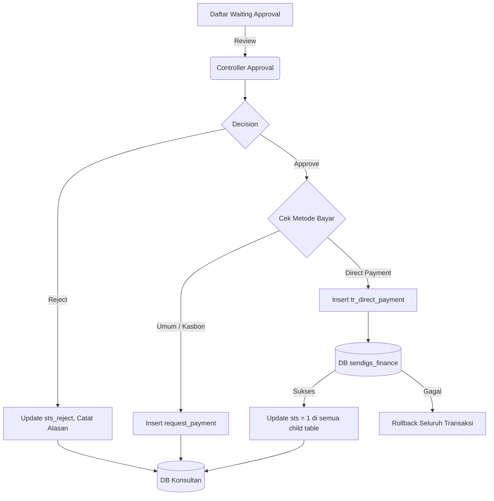

# System Design Document: Modul Approval Kasbon Project

## 1. Context & Goals
**Background Singkat:** 
Modul ini bertindak sebagai pemutus (Decision Maker) dalam rantai pasokan kas operasional. Fitur unggulannya adalah kemampuannya menyeberang *database* (Cross-DB Interface) ke wilayah ekosistem Akuntansi (*sendigs_finance*) agar pembayaran seperti *Direct Payment* (Vendor) bisa diproses *Finance* tanpa pengetikan manual ulang.

**Out of Scope:** 
Eksekusi pembayaran bank otomatis via API.

---

## 2. Proposed Architecture
**Architecture Diagram:**


**Component Breakdown:**
- **Approval Engine:** Berisi fungsi `approve_kasbon()` dan `reject_kasbon()`. 
- **Database Bridging:** Menggunakan inisiasi CI3 `$this->otherdb = $this->load->database('sendigs_finance', TRUE)` untuk mengakses *database* eksternal milik *finance*.

---

## 3. Data Model & Storage
**Schema Database (ERD Singkat):**
- **Tabel Internal:** `kons_tr_kasbon_project_header`, `kons_tr_req_kasbon_project`, `request_payment`.
- **Tabel Eksternal (Finance DB):** `tr_direct_payment` (Kolom penting: `no_doc`, `id_spk_penawaran`, `grand_total`, data perbankan).

**Caching Strategy:**
- Tidak menggunakan skema *cache* karena operasi baca-tulis (*read/write*) yang melibatkan persetujuan keuangan harus benar-benar *real-time*.

---

## 4. Interface Definitions (API Contract)
**A. Approve Kasbon Endpoint**
- **Endpoint:** `POST /approval_kasbon_project/approve_kasbon`
- **Request Payload:** `id_kasbon`
- **Response Payload:** `status: 1, pesan: 'Data has been approved !'`

**B. Reject Kasbon Endpoint**
- **Endpoint:** `POST /approval_kasbon_project/reject_kasbon`
- **Request Payload:**
  ```json
  {
    "id_kasbon": "HDR-001",
    "reject_reason": "Harga sewa vendor terlalu mahal, revisi kembali."
  }
  ```

---

## 5. Non-Functional Requirements & Trade-offs
**Reliability & Integrity (Kritis):**
- Eksekusi persetujuan dienkapsulasi menggunakan `db->trans_begin()`. 
- Karena melibatkan 2 *Database Group* yang berbeda (`$this->db` dan `$this->otherdb`), *Transaction Manager* hanya bisa mengawasi 1 koneksi `db` lokal secara murni. Jika *query* ke `otherdb` gagal, script dipaksa mengeksekusi `rollback()` manual untuk `db` lokal dan menghentikan kode (Exception Throw).

**Scalability:**
- Kueri `get_data_spk()` (List Server Side Datatables) menggunakan penggabungan banyak relasi `JOIN`. Sangat disarankan kolom `id_spk_budgeting` dan `sts` dibuatkan *Index*.

**Trade-offs:**
- Memilih menyuntikkan data *Direct Payment* secara SQL ke DB *Finance* daripada membuat REST API khusus di sisi aplikasi *Finance*.
  *Keuntungan:* Eksekusi sangat cepat, kode lebih ringkas tanpa perlu *setup* otentikasi JWT antar *server*.
  *Kelemahan:* *Coupling* sangat tinggi. Jika admin/tim IT Finance mengubah skema kolom `tr_direct_payment`, kode di aplikasi Konsultan akan langsung *error (crash)*.

---

## 6. Infrastructure & Deployment Impact
**Infrastructure Changes:**
- Server aplikasi harus di- *allow* untuk melakukan interaksi MySQL *remote/cross-db* ke *host* server `sendigs_finance`. Pastikan port 3306 atau konfigurasi IP Whitelist antar DB sudah terbuka.

**Migration Plan:**
- DDL untuk penyesuaian kolom `sts_reject` dan `reject_reason` pada tabel `kons_tr_req_kasbon_project`.
- Setelan *Credential* DB eksternal pada `application/config/database.php` grup `sendigs_finance`.
