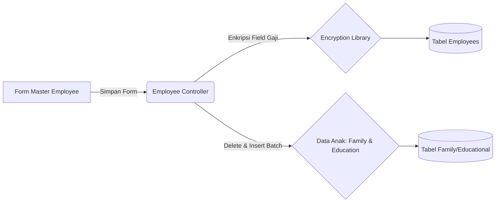

# System Design Document: Modul Master Employee

## 1. Context & Goals
**Background Singkat:** 
Data hierarki pegawai dan profilnya harus menjadi entitas pusat di dalam aplikasi sebelum penugasan ke proyek (SPK) dapat dilakukan. Master Employee akan mencatat informasi Gaji, Pendidikan, dan Keluarga.

**Out of Scope:** 
Tidak menyinggung modul presensi absensi bulanan atau integrasi sistem *Payroll* otomatis yang menghitung potongan asuransi/BPJS.

---

## 2. Proposed Architecture
**Architecture Diagram:**

**Component Breakdown:**
- **Encryption Helper:** Sebuah *Library / Helper* fungsi `Enkripsi()` di CodeIgniter yang menyandikan (Cipher) kolom *salary*, *jabatan*, dan *pulsa*.
- **Wipe & Replace Array Method:** Pada proses Edit, Controller menghapus secara masal (`DELETE FROM family WHERE employee_id...`) lalu merakit ulang `insert_batch()` dari *Array Input* baru.

---

## 3. Data Model & Storage
**Schema Database (ERD Singkat):**
- **`employees`**: PK `id` (EMP-...), NIK (Auto), `name`, `salary`, `jabatan`. Relasi ke tabel Master *Divisions*.
- **`family` & `educational`**: Relasi 1-to-Many ke tabel *employees*.

**Caching Strategy:**
- Tidak diterapkan. Master data di-*render* langsung via *server-side* datatables.

---

## 4. Interface Definitions (API Contract)
**A. Dependent Dropdown (Divisi & Department)**
- **Endpoint:** `GET /employees/getDept/{kode_divisi}`
- **Response Payload:** JSON struktur Data Array dari Departemen terkait (sebagai bahan *render* elemen Select Option).

---

## 5. Non-Functional Requirements & Trade-offs
**Scalability & Performance:**
- Eksekusi *Wipe & Replace* pada tabel Anak bisa memberatkan *database* pada saat *traffic* tinggi, namun mengingat fitur ini jarang digunakan secara paralel masif (hanya admin HRD), performansinya masuk dalam toleransi (*Acceptable*).

**Security:**
- Kriptografi sederhana untuk nilai uang (Gaji).
- Pengecekan Menu Access Control (MAC) melalui fungsi `getAcccesmenu()`. Hanya role dengan `create == 1` yang dapat mengakses form *Add*.

**Trade-offs:**
- Menyimpan NIK menggunakan generator *string-manipulation* SQL daripada generator *Primary Key Auto-Increment* bawaan DB agar penomoran format (Contoh: NIK `202607-001`) bisa diterapkan konsisten secara bisnis.

---

## 6. Infrastructure & Deployment Impact
**Infrastructure Changes:**
- Mengandalkan konfigurasi *Encryption Key* `config['encryption_key']` di konfigurasi CodeIgniter. Key ini dilarang keras diubah setelah rilis ke *Production* karena data gaji lama tidak akan bisa didekripsi.

**Migration Plan:**
- Konfigurasi tabel HR Sentral. Tidak ada dampak besar pada infrastruktur lainnya.
