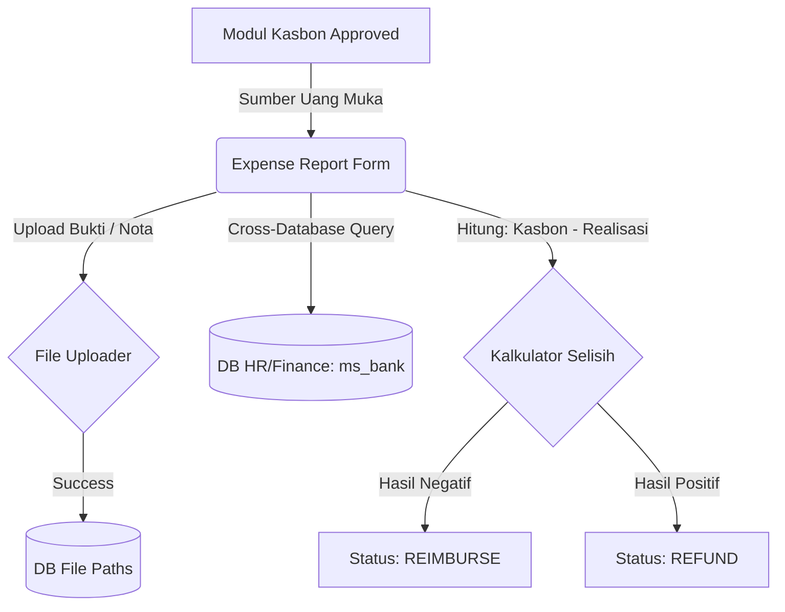

# System Design Document: Modul Expense Report Project

## 1. Context & Goals
**Background Singkat:** 
Sistem lama tidak menelusuri nota fisik secara komprehensif setelah kasbon dicairkan, menyebabkan banyak akun menggantung (unresolved accounts). 
Modul Expense Report Project bertujuan menciptakan formulir realisasi (*Actual Cost*) yang akan membandingkan uang muka (Kasbon) dengan pengeluaran riil, menghasilkan output hitungan *Refund* atau *Reimburse*.

**Out of Scope:** 
Sistem ini tidak memotong gaji karyawan secara otomatis jika mereka terlambat me-*refund* sisa kasbon (Ini harus dilakukan manual di Payroll/Finance).

---

## 2. Proposed Architecture
**Architecture Diagram:**


**Component Breakdown:**
- **Expense Report Controller:** Menangani form input sisi kanan (Realisasi) dan kiri (Read-Only Kasbon), serta *handler* proses *upload file*.
- **Cross-Database Interface:** Mekanisme koneksi khusus di CodeIgniter untuk mengambil profil rekening bank (*ms_bank*) yang letaknya di database terpisah (database `gl_sendigs` atau `sendigs_finance`).

---

## 3. Data Model & Storage
**Schema Database (ERD Singkat):**
- **`kons_tr_expense_report`** (Header): `id_expense` (PK), `id_kasbon` (FK), `tgl_pelaporan`, `status`.
- **`kons_tr_expense_report_detail`** (Items): Input baris per nota/kuitansi, nominal riil pengeluaran.
- **File System (Storage):** Nota kuitansi tidak disimpan di SQL (Blob), melainkan di direktori fisik server (Misal: `uploads/expense/`), yang disimpan di DB hanyalah *path* / *file name*.

**Caching Strategy:**
- Tidak ada *cache*. Akses ke database eksternal `ms_bank` dilakukan secara langsung saat *dropdown select* di-*render*.

---

## 4. Interface Definitions (API Contract)
**A. Submit Expense Report (Form Data with File)**
- **Endpoint:** `POST /expense_report_project/save`
- **Request Payload:** Form *Multipart* dengan *nested arrays* dan File Upload.
  ```json
  {
    "id_kasbon": "KAS-2026-001",
    "expense_items[0][deskripsi]": "Hotel 2 Malam",
    "expense_items[0][nominal_realisasi]": "1800000",
    "upload_nota": [File Binary JPG]
  }
  ```
- **Response Payload:**
  ```json
  {
    "status": 1,
    "pesan": "Laporan Expense berhasil disimpan. Status Anda: REFUND Rp 200.000."
  }
  ```

---

## 5. Non-Functional Requirements & Trade-offs
**Scalability & Performance:**
- Disk I/O akan meningkat drastis akibat fitur *File Upload*. Ukuran maksimal (*Max Upload Size*) perlu dibatasi (contoh: 2MB per file gambar) dengan tipe MIME yang ketat (JPG, PNG, PDF) agar disk server tidak cepat penuh.

**Security:**
- Mencegah akses file nota sembarangan (*Directory Traversal*). File yang diunggah harus dibungkus hash unik atau diproteksi oleh `.htaccess` agar tidak bisa diakses publik (Hanya untuk Admin/Finance).

**Trade-offs:**
- **Cross-Database vs Data Replication:** Mengambil referensi dari DB eksternal (`ms_bank`) ketimbang menduplikasinya ke DB saat ini. 
  *Keuntungan:* Data rekening Bank selalu mutakhir (*Single Source of Truth* dari HR). 
  *Kelemahan:* Jika koneksi antar-DB lambat atau down, form *dropdown* di laporan Expense akan *blank/error*.

---

## 6. Infrastructure & Deployment Impact
**Infrastructure Changes:**
- Pembuatan folder konfigurasi untuk manajemen file *upload* (Perizinan `CHMOD 777` atau `755` pada *directory uploads* Linux).
- Pengaturan *Multiple Database Group* di `application/config/database.php` CI3.

**Migration Plan:**
- Sinkronisasi konfigurasi *Environment Variables* untuk *credentials* database `sendigs_finance`.
