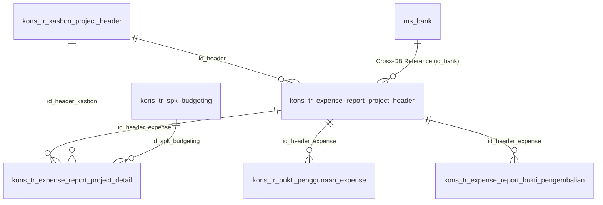

# ERD Database - Modul Expense Report Project

## Informasi Database

| Parameter   | Nilai             |
| ----------- | ----------------- |
| Host        | mysql8 (Docker)   |
| Port        | 3307              |
| Database    | db_consultant_new |
| Driver      | mysqli            |
| User        | root              |
| Total Tabel | 4 tabel utama     |

## Daftar Tabel

### Tabel Transaksi:

1. `kons_tr_expense_report_project_header` - Header Expense Report Project
2. `kons_tr_expense_report_project_detail` - Detail Expense Report Project
3. `kons_tr_bukti_penggunaan_expense` - Bukti Upload Penggunaan Expense (Nota/Kuitansi)
4. `kons_tr_expense_report_bukti_pengembalian` - Bukti Upload Pengembalian Expense (Transfer)

### Related Tables (Internal):

- `kons_tr_kasbon_project_header` (FK: `id_header`, `id_header_kasbon`)
- `kons_tr_spk_budgeting` (FK: `id_spk_budgeting` pada tabel detail)
- `kons_tr_spk_penawaran` (FK: `id_spk_penawaran` pada tabel detail)
- `kons_tr_penawaran` (FK: `id_penawaran` pada tabel detail)

### Related Tables (Eksternal / Cross-Database):

- `ms_bank` (Terletak di database `gl_sendigs` atau `sendigs_finance` - HR/Finance DB)

---

## ERD Diagram



---

## Penjelasan Relasi

### A. Expense Report Project (Flow Utama)
```text
kons_tr_kasbon_project_header (1) ──── (N) kons_tr_expense_report_project_header
                                              │
                                              ├── (N) kons_tr_expense_report_project_detail
                                              ├── (N) kons_tr_bukti_penggunaan_expense
                                              └── (N) kons_tr_expense_report_bukti_pengembalian
                                              
[DB: gl_sendigs] ms_bank (1) ─────────────────(N) (Referensi Profil Rekening Bank)
```

---

## Alur Kalkulasi Selisih & Approval

Modul Expense Report Project bertujuan menciptakan formulir realisasi (*Actual Cost*) yang akan membandingkan uang muka (Kasbon) dengan pengeluaran riil. Laporan expense akan menghitung `selisih` antara `total_kasbon` dan `total_expense_report`.

| Kondisi                                        | Output / Status     | Keterangan                                                               |
| ---------------------------------------------- | ------------------- | ------------------------------------------------------------------------ |
| `total_kasbon` > `total_expense_report`        | **REFUND**          | Sisa uang muka wajib dikembalikan, dilampirkan dengan bukti transfer.    |
| `total_kasbon` < `total_expense_report`        | **REIMBURSE**       | Pengeluaran riil lebih besar, perusahaan akan reimburse (kurang bayar).  |

Header tabel ini juga memiliki flag `sts`, `sts_req`, `sts_reject`, `sts_reject_manage` untuk workflow approval.

---

## Struktur Tabel

### 1. kons_tr_expense_report_project_header

**Header Expense Report Project** — Menyimpan rangkuman total expense dan perhitungan selisih dengan kasbon awal.

| Field                   | Type          | Null | Key | Default | Keterangan                                       |
| ----------------------- | ------------- | ---- | --- | ------- | ------------------------------------------------ |
| id                      | varchar(100)  | NO   | PRI | NULL    | PK                                               |
| id_header               | varchar(100)  | NO   | FK  | NULL    | FK ke `kons_tr_kasbon_project_header`            |
| total_expense_report    | decimal(20,2) | NO   |     | 0.00    | Total aktual pemakaian expense                   |
| total_kasbon            | decimal(20,2) | NO   |     | 0.00    | Total nilai pencairan kasbon awal                |
| selisih                 | decimal(20,2) | NO   |     | 0.00    | Selisih (total_kasbon - total_expense)           |
| tipe                    | varchar(100)  | YES  |     | NULL    | Tipe expense                                     |
| document_link           | text          | YES  |     | NULL    | Link dokumen pendukung utama                     |
| bank                    | varchar(100)  | YES  |     | NULL    | Nama bank untuk refund/reimburse                 |
| bank_number             | varchar(100)  | YES  |     | NULL    | Nomor rekening                                   |
| bank_account            | varchar(100)  | YES  |     | NULL    | Nama pemilik rekening                            |
| sts                     | varchar(5)    | YES  |     | NULL    | Status utama expense                             |
| sts_req                 | varchar(5)    | YES  |     | NULL    | Status request pengajuan                         |
| sts_req_payment         | char(1)       | NO   |     | NULL    | Status request pembayaran                        |
| sts_reject              | char(1)       | YES  |     | NULL    | Status penolakan                                 |
| sts_reject_manage       | char(1)       | YES  |     | NULL    | Status penolakan dari management                 |
| reject_reason           | text          | YES  |     | NULL    | Alasan ditolak                                   |
| keterangan_kurang_bayar | text          | YES  |     | NULL    | Keterangan reimburse jika expense > kasbon       |
| id_bank                 | varchar(20)   | YES  |     | NULL    | ID Bank internal (Eksternal DB referensi)        |
| nm_bank                 | text          | YES  |     | NULL    | Nama Bank internal                               |
| created_by              | varchar(100)  | YES  |     | NULL    | User pembuat                                     |
| created_date            | datetime      | YES  |     | NULL    | Tanggal pembuatan                                |
| updated_by              | varchar(100)  | YES  |     | NULL    | User terakhir update                             |
| updated_date            | datetime      | YES  |     | NULL    | Tanggal update terakhir                          |
| approved_by             | varchar(100)  | YES  |     | NULL    | User yang menyetujui                             |
| approved_date           | datetime      | YES  |     | NULL    | Tanggal persetujuan                              |
| rejected_by             | int           | YES  |     | NULL    | User yang menolak                                |
| rejected_date           | datetime      | YES  |     | NULL    | Tanggal ditolak                                  |

---

### 2. kons_tr_expense_report_project_detail

**Detail Expense Report Project** — Menyimpan rincian pemakaian untuk tiap item kasbon (akomodasi, lab, others, subcont) yang mencerminkan nota satuan.

| Field              | Type          | Null | Key | Default | Keterangan                                       |
| ------------------ | ------------- | ---- | --- | ------- | ------------------------------------------------ |
| id                 | int           | NO   | PRI | NULL    | Auto increment                                   |
| id_header_expense  | varchar(100)  | YES  | FK  | NULL    | FK ke header expense                             |
| id_header_kasbon   | varchar(100)  | YES  | FK  | NULL    | FK ke header kasbon                              |
| id_spk_budgeting   | varchar(100)  | YES  | FK  | NULL    | FK ke budgeting project                          |
| id_spk_penawaran   | varchar(100)  | YES  | FK  | NULL    | FK ke spk penawaran                              |
| id_penawaran       | varchar(100)  | YES  | FK  | NULL    | FK ke penawaran                                  |
| id_detail_kasbon   | varchar(100)  | YES  | FK  | NULL    | FK ke baris id pada tabel detail kasbon terkait  |
| tipe               | varchar(100)  | YES  |     | NULL    | Penanda tipe (akomodasi, lab, others, dll)       |
| qty_expense        | decimal(20,2) | NO   |     | 0.00    | Qty pemakaian aktual                             |
| nominal_expense    | decimal(20,2) | NO   |     | 0.00    | Harga aktual pemakaian per qty                   |
| keterangan         | text          | YES  |     | NULL    | Catatan pemakaian (opsional)                     |
| created_by         | varchar(100)  | YES  |     | NULL    | User penginput detail                            |
| created_date       | datetime      | YES  |     | NULL    | Waktu input                                      |

---

### 3. kons_tr_bukti_penggunaan_expense

**Bukti Penggunaan Expense** — Berisi attachment upload file (nota, bon, kuitansi) untuk pemakaian aktual expense. File fisik disimpan dalam folder `uploads`.

| Field              | Type         | Null | Key | Default | Keterangan                               |
| ------------------ | ------------ | ---- | --- | ------- | ---------------------------------------- |
| id                 | int          | NO   | PRI | NULL    | Auto increment                           |
| id_header_expense  | varchar(255) | NO   | FK  | NULL    | FK ke header expense                     |
| upload_file        | text         | NO   |     | NULL    | Path file / Nama file bukti pemakaian    |
| created_by         | varchar(10)  | NO   |     | NULL    | User pengupload                          |
| created_date       | datetime     | NO   |     | NULL    | Waktu upload                             |

---

### 4. kons_tr_expense_report_bukti_pengembalian

**Bukti Pengembalian Expense** — Berisi dokumen bukti transfer pengembalian sisa dana kasbon apabila kalkulasi menghasilkan status Refund (`total_kasbon` > `total_expense_report`).

| Field              | Type         | Null | Key | Default | Keterangan                               |
| ------------------ | ------------ | ---- | --- | ------- | ---------------------------------------- |
| id                 | int          | NO   | PRI | NULL    | Auto increment                           |
| id_header_expense  | varchar(100) | YES  | FK  | NULL    | FK ke header expense                     |
| document_link      | text         | YES  |     | NULL    | Path / URL file bukti transfer refund    |
| created_by         | varchar(100) | YES  |     | NULL    | User pengupload                          |
| created_date       | datetime     | YES  |     | NULL    | Waktu upload                             |

---

## Related Tables (Ringkasan)

### kons_tr_kasbon_project_header (Ringkasan)

| Field            | Type          | Key | Keterangan                      |
| ---------------- | ------------- | --- | ------------------------------- |
| id               | varchar(100)  | PRI | Primary key                     |
| id_spk_budgeting | varchar(100)  | FK  | FK ke SPK Budgeting             |
| grand_total      | decimal(20,2) |     | Total pencairan uang muka       |
| sts              | varchar(5)    |     | Status kasbon (aktif/approved)  |

### kons_tr_spk_budgeting (Ringkasan)

| Field                | Type          | Key | Keterangan                    |
| -------------------- | ------------- | --- | ----------------------------- |
| id_spk_budgeting     | varchar(100)  | PRI | Primary key                   |
| id_customer          | varchar(100)  | FK  | FK ke tabel customer          |
| grand_total          | decimal(20,2) |     | Nilai total budget project    |

### ms_bank (Cross-Database Ringkasan)

| Field       | Type         | Key | Keterangan                                 |
| ----------- | ------------ | --- | ------------------------------------------ |
| id          | varchar(20)  | PRI | Primary Key bank                           |
| nm_bank     | varchar(100) |     | Nama bank resmi                            |
| *Database*  | *Eksternal*  |     | *Berada di DB `gl_sendigs`*                |

---

## Catatan Teknis

> ⚠️ **Penting untuk Developer**

1. **Relasi Polymorphic Manual** — Pada tabel detail (`kons_tr_expense_report_project_detail`), field `id_detail_kasbon` mengacu pada baris (ID) dari tabel detail kasbon. Tabel apa yang dirujuk bergantung pada field `tipe` (apakah akomodasi, lab, others, atau subcont).
2. **File System Storage (BLOB vs Physical)** — Nota kuitansi tidak disimpan di dalam format blob SQL. Sistem akan menyimpan file di direktori fisik server (`uploads/expense_report_project/`) dan DB hanya mencatat string path / nama file-nya saja.
3. **Cross-Database Interface** — Pada form expense, untuk pengambilan data profil rekening bank (`ms_bank`), Query harus menembak lintas-database ke database HR/Finance (`gl_sendigs` atau `sendigs_finance`), bukan `db_consultant_new`. Gunakan multiple database group connection di `config/database.php` CI3.
4. **Pemisahan Dokumen** — Terdapat dua buah tabel bukti (`kons_tr_bukti_penggunaan_expense` dan `kons_tr_expense_report_bukti_pengembalian`). Ini dilakukan secara sengaja agar mudah memfilter/memisahkan mana tumpukan nota belanja dan mana lembar bukti transfer (Refund).
5. **No Soft Delete pada Detail** — Untuk detail nota pemakaian tidak memiliki `deleted_at`, manajemen baris bersifat langsung hapus (Hard Delete) apabila nota tersebut direvisi sebelum *submit*.
