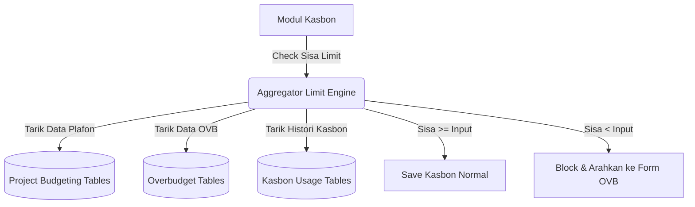

# System Design Document: Modul Kasbon Project

## 1. Context & Goals
**Background Singkat:** 
Modul kasbon lama tidak mampu membatasi nilai penarikan uang. Sering kali konsultan menarik kasbon hingga nilai kumulatifnya melampaui sisa keuntungan yang ditargetkan di awal.
Modul ini bertindak sebagai penjaga gawang (*Gatekeeper*) untuk validasi Sisa Limit Budget dan menangani eskalasi penambahan limit (*Overbudget/OVB*).

**Out of Scope:** 
Modul ini hanya mencatat "Permintaan Pengeluaran" dan proses "Approval", tidak melakukan pencatatan penjurnalan akuntansi (*General Ledger*) secara *real-time*.

---

## 2. Proposed Architecture
**Architecture Diagram:**


**Component Breakdown:**
- **Limit Aggregator (Controller):** Sebuah *query builder* berat yang merajut *UNION ALL* untuk menghitung nilai `Plafon Awal + OVB - Kasbon Cair - Kasbon On Process`.
- **OVB Router:** Mekanisme rute alternatif jika form terdeteksi melebihi limit.

---

## 3. Data Model & Storage
**Schema Database (ERD Singkat):**
- **`kons_tr_kasbon_project_header`**: Metadata pengajuan (PK: `id`, `id_spk_budgeting`).
- Tabel Anak (Kasbon): `..._subcont`, `..._akomodasi`, `..._lab`, dst.
- Tabel Overbudget (OVB): `kons_tr_kasbon_req_ovb_akomodasi_header` (dsb). Jika *Approved*, `budget_tambahan` bertambah.

**Caching Strategy:**
- Tidak ada *cache*. Limit uang harus divalidasi sangat mutakhir (*Live Query*) untuk menghindari *double spend* (dua orang mengajukan sisa uang yang sama pada detik yang bersamaan).

---

## 4. Interface Definitions (API Contract)
**A. Submit Kasbon (AJAX Form)**
- **Endpoint:** `POST /kasbon_project/save_kasbon`
- **Request Payload:**
  ```json
  {
    "id_spk_budgeting": "BDG-2026-001",
    "akomodasi": [
       {"id_biaya": "AK-01", "qty": 1, "nominal": 2000000}
    ]
  }
  ```
- **Response Payload:** (Jika gagal karena limit)
  ```json
  {
    "status": 0,
    "pesan": "Limit tidak mencukupi, harap lakukan request Overbudget (OVB) terlebih dahulu!"
  }
  ```

---

## 5. Non-Functional Requirements & Trade-offs
**Scalability & Performance:**
- **Kinerja SQL yang berat:** Mengingat arsitektur database kasbon yang sangat terfragmentasi (dipisah berdasarkan 5-6 kategori tabel), kueri `UNION ALL` di `get_data_spk()` dapat menimbulkan *bottleneck* apabila transaksi sudah mencapai > 10.000 *records*. 
- *Solusi Performance (Jika terjadi lag):* Membutuhkan index yang tepat pada `id_spk_budgeting` dan `sts` di ke-12 tabel yang di-*UNION*.

**Security:**
- Mencegah Modifikasi Limit dari Front-End (Inspect Element/JS manipulation). Sisa Saldo harus dicek ulang secara murni di level Controller backend sebelum `insert`.

**Trade-offs:**
- **Highly Normalized vs Single Table:** Sistem lama memecah tabel kasbon per kategori (Lab, Subcont, dll). 
  *Kekurangan:* Eksekusi perhitungan Sisa Limit menjadi rumit dan baris kode (*LoC*) membengkak.
  *Kelebihan:* Struktur data yang konsisten dengan modul *Project Budgeting*. Tidak diubah ke *Single Table* agar *compatibility* dengan sistem lama tetap terjaga.

---

## 6. Infrastructure & Deployment Impact
**Infrastructure Changes:**
- -

**Migration Plan:**
- Sinkronisasi struktur tabel Kasbon Anak (tambah index) agar kueri agregasi tidak terlalu lambat.
