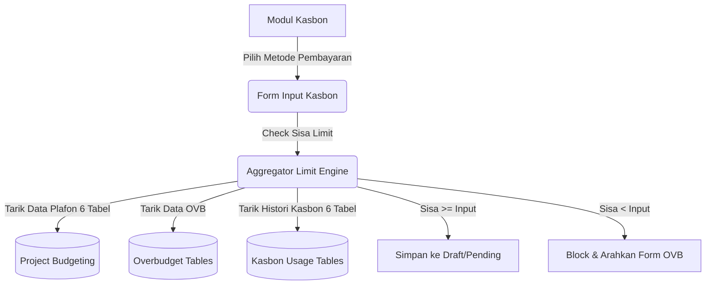

# System Design Document: Modul Kasbon Project

## 1. Context & Goals
**Background Singkat:** 
Modul kasbon berfungsi sebagai "Gerbang" (Gatekeeper) pertama untuk memvalidasi uang keluar. Dengan adanya penambahan jenis biaya seperti *Subcont Perusahaan* dan *Metode Pembayaran*, mesin validasi *budget* perlu menampung kueri yang lebih raksasa.

**Out of Scope:** 
Tidak melakukan proses eksekusi Approval atau manipulasi database *Finance* (Ditangani di Modul Approval Kasbon).

---

## 2. Proposed Architecture
**Architecture Diagram:**

**Component Breakdown:**
- **Limit Aggregator (Controller):** Sebuah *query builder* berat yang merajut SQL *UNION ALL* untuk menghitung nilai Sisa Plafon berdasarkan Akomodasi, Others, Lab, Subcont, Subcont Tenaga Ahli, dan Subcont Perusahaan.
- **Payment Method Flagging:** Field penanda status (1 = Kasbon, 2 = Direct Payment, 3 = PO) yang kelak dioper ke *Finance*.

---

## 3. Data Model & Storage
**Schema Database (ERD Singkat):**
- **`kons_tr_kasbon_project_header`**: Metadata pengajuan (PK: `id`). Kolom krusial: `id_spk_budgeting`, `tipe`, `metode_pembayaran`, `sts_reject`.
- **Tabel Anak (Kasbon Detail):** `kons_tr_kasbon_project_subcont`, `..._akomodasi`, `..._others`, `..._lab`, `..._subcont_tenaga_ahli`, `..._subcont_perusahaan`.
- **`kons_tr_req_kasbon_project`**: Antrean (Queue) dokumen pengajuan untuk dilempar ke menu Approval.

**Caching Strategy:**
- Tidak ada *cache*. Limit uang harus divalidasi mutakhir (*Live SQL Query*) untuk mencegah *double spending*.

---

## 4. Interface Definitions (API Contract)
**A. Generate Data SPK (Datatables Server Side)**
- **Endpoint:** `POST /kasbon_project/get_data_spk`
- **Response Payload:** Mereturn baris tabel JSON lengkap dengan status Tombol (Tombol Pensil untuk Edit, Panah Atas untuk *Request Approval OVB*, atau *Badge Approved/Rejected*).

---

## 5. Non-Functional Requirements & Trade-offs
**Scalability & Performance:**
- **Kinerja SQL Sangat Berat:** Kueri `UNION ALL` di `get_data_spk()` mengeksekusi puluhan *Select*. Sangat berpotensi menimbulkan *bottleneck* apabila *traffic* padat. 
- **Solusi Wajib:** Implementasi *Indexing* pada seluruh kolom `id_spk_budgeting` dan flag `sts` / `deleted_at` di dalam 18 buah tabel bersangkutan. Tanpa indeks, sistem akan melambat secara eksponensial.

**Trade-offs:**
- **Fragmented Tables vs Single Master Table:** Sistem masih menganut pemecahan tabel kasbon per kategori biaya (*Subcont, Lab, dsb*) demi menjaga kompabilitas kode lama, alih-alih menggabungkannya ke dalam 1 tabel master berkolom `jenis_biaya` yang jauh lebih mudah di-kueri.

---

## 6. Infrastructure & Deployment Impact
**Migration Plan:**
- Alter Tabel `kons_tr_kasbon_project_header` untuk penambahan kolom `metode_pembayaran` dan integrasi indeks MySQL pada foreign key anggaran.
