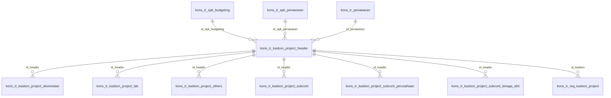

# ERD Database - Modul Kasbon Project

## Informasi Database

| Parameter   | Nilai             |
| ----------- | ----------------- |
| Host        | mysql8 (Docker)   |
| Port        | 3307              |
| Database    | db_consultant_new |
| Driver      | mysqli            |
| User        | root              |
| Total Tabel | 8 tabel           |

## Daftar Tabel

### Tabel Transaksi:

1. `kons_tr_kasbon_project_header` - Header Kasbon Project
2. `kons_tr_kasbon_project_akomodasi` - Detail kasbon akomodasi
3. `kons_tr_kasbon_project_lab` - Detail kasbon lab
4. `kons_tr_kasbon_project_others` - Detail kasbon lain-lain
5. `kons_tr_kasbon_project_subcont` - Detail kasbon subcont aktifitas
6. `kons_tr_kasbon_project_subcont_perusahaan` - Detail kasbon subcont perusahaan
7. `kons_tr_kasbon_project_subcont_tenaga_ahli` - Detail kasbon subcont tenaga ahli
8. `kons_tr_req_kasbon_project` - Log / Request status kasbon project

### Related Tables:

- `kons_tr_spk_budgeting` (FK: id_spk_budgeting)
- `kons_tr_spk_penawaran` (FK: id_spk_penawaran)
- `kons_tr_penawaran` (FK: id_penawaran)

---

## ERD Diagram



---

## Penjelasan Relasi

### A. Kasbon Project (Flow Utama)
```text
kons_tr_spk_budgeting (1) ──── (N) kons_tr_kasbon_project_header
                                  │
                                  ├── (N) kons_tr_kasbon_project_akomodasi
                                  ├── (N) kons_tr_kasbon_project_lab
                                  ├── (N) kons_tr_kasbon_project_others
                                  ├── (N) kons_tr_kasbon_project_subcont
                                  ├── (N) kons_tr_kasbon_project_subcont_perusahaan
                                  ├── (N) kons_tr_kasbon_project_subcont_tenaga_ahli
                                  └── (N) kons_tr_req_kasbon_project
```

---

## Alur Approval Kasbon Project

Tabel `kons_tr_kasbon_project_header` memiliki beberapa flag status, diantaranya `sts`, `sts_req`, `sts_req_payment`, `sts_reject`, `sts_reject_manage`.

| Field / Status       | Keterangan                                       |
| -------------------- | ------------------------------------------------ |
| `sts`                | Status utama kasbon                              |
| `sts_req`            | Status request                                   |
| `sts_req_payment`    | Status request pembayaran                        |
| `sts_reject`         | Flag penolakan                                   |
| `sts_reject_manage`  | Flag penolakan management                        |
| `metode_pembayaran`  | 1, 2, atau 3 (Tipe metode pembayaran kasbon)     |

---

## Struktur Tabel

### 1. kons_tr_kasbon_project_header

**Header Kasbon Project** — Tabel utama menyimpan data pengajuan kasbon.

| Field             | Type          | Null | Key | Default | Keterangan                                 |
| ----------------- | ------------- | ---- | --- | ------- | ------------------------------------------ |
| id                | varchar(100)  | NO   | PRI | NULL    | PK                                         |
| id_spk_budgeting  | varchar(100)  | NO   | FK  | NULL    | FK ke kons_tr_spk_budgeting                |
| id_spk_penawaran  | varchar(100)  | YES  | FK  | NULL    | FK ke kons_tr_spk_penawaran                |
| id_penawaran      | varchar(100)  | YES  | FK  | NULL    | FK ke kons_tr_penawaran                    |
| tipe              | varchar(5)    | YES  |     | NULL    | Tipe kasbon                                |
| deskripsi         | text          | YES  |     | NULL    | Deskripsi pengajuan                        |
| tgl               | date          | YES  |     | NULL    | Tanggal pengajuan                          |
| grand_total       | decimal(20,2) | YES  |     | NULL    | Grand total kasbon                         |
| sts               | varchar(5)    | YES  |     | NULL    | Status kasbon                              |
| sts_req           | varchar(5)    | YES  |     | NULL    | Status request                             |
| dokument_link     | text          | YES  |     | NULL    | Link dokumen pendukung                     |
| bank              | varchar(100)  | YES  |     | NULL    | Nama bank                                  |
| bank_number       | varchar(100)  | YES  |     | NULL    | Nomor rekening                             |
| bank_account      | varchar(100)  | YES  |     | NULL    | Nama pemilik rekening                      |
| sts_req_payment   | char(1)       | NO   |     | NULL    | Status request pembayaran                  |
| sts_reject        | char(1)       | YES  |     | NULL    | Status reject                              |
| sts_reject_manage | char(1)       | YES  |     | NULL    | Status reject dari management              |
| reject_reason     | text          | YES  |     | NULL    | Alasan penolakan                           |
| metode_pembayaran | enum          | YES  |     | 1       | Metode pembayaran (1, 2, 3)                |
| created_by        | varchar(20)   | YES  |     | NULL    | User pembuat                               |
| created_date      | datetime      | YES  |     | NULL    | Tanggal dibuat                             |
| updated_by        | varchar(20)   | YES  |     | NULL    | User update                                |
| updated_date      | datetime      | YES  |     | NULL    | Tanggal update                             |
| approved_by       | varchar(100)  | YES  |     | NULL    | User penyetuju                             |
| approved_date     | datetime      | YES  |     | NULL    | Tanggal disetujui                          |
| deleted_at        | datetime      | YES  |     | NULL    | Tanggal soft delete                        |
| deleted_by        | int           | YES  |     | NULL    | User penghapus                             |
| rejected_by       | int           | YES  |     | NULL    | User penolak                               |
| rejected_date     | datetime      | YES  |     | NULL    | Tanggal penolakan                          |

---

### 2. kons_tr_kasbon_project_akomodasi

**Detail Kasbon Akomodasi** — Menyimpan detail pengajuan kasbon untuk biaya akomodasi.

| Field                 | Type          | Null | Key | Default | Keterangan                          |
| --------------------- | ------------- | ---- | --- | ------- | ----------------------------------- |
| id                    | int           | NO   | PRI | NULL    | Auto increment                      |
| id_header             | varchar(100)  | YES  | FK  | NULL    | FK ke kons_tr_kasbon_project_header |
| id_spk_budgeting      | varchar(100)  | YES  | FK  | NULL    | FK ke kons_tr_spk_budgeting         |
| id_akomodasi          | varchar(100)  | YES  |     | NULL    | ID master akomodasi                 |
| id_item               | varchar(100)  | YES  |     | NULL    | ID Item akomodasi                   |
| nm_item               | text          | YES  |     | NULL    | Nama item                           |
| qty_pengajuan         | decimal(20,2) | YES  |     | NULL    | QTY yang diajukan                   |
| nominal_pengajuan     | decimal(20,2) | YES  |     | NULL    | Harga satuan pengajuan              |
| total_pengajuan       | decimal(20,2) | YES  |     | NULL    | Total biaya pengajuan               |
| qty_estimasi          | decimal(20,2) | YES  |     | NULL    | QTY dari budget estimasi            |
| price_unit_estimasi   | decimal(20,2) | YES  |     | NULL    | Harga dari budget estimasi          |
| total_budget_estimasi | decimal(20,2) | YES  |     | NULL    | Total dari budget estimasi          |
| aktual_terpakai       | decimal(20,2) | NO   |     | 0.00    | Aktual pemakaian                    |
| sisa_budget           | decimal(20,2) | NO   |     | NULL    | Sisa budget                         |
| qty_terpakai          | decimal(20,2) | NO   |     | 0.00    | QTY yang telah terpakai             |
| nominal_terpakai      | decimal(20,2) | NO   |     | 0.00    | Nominal yang telah terpakai         |
| total_terpakai        | decimal(20,2) | NO   |     | 0.00    | Total yang telah terpakai           |
| qty_overbudget        | decimal(20,2) | NO   |     | 0.00    | QTY overbudget                      |
| nominal_overbudget    | decimal(20,2) | NO   |     | 0.00    | Nominal overbudget                  |
| total_overbudget      | decimal(20,2) | NO   |     | 0.00    | Total overbudget                    |
| document_link         | text          | YES  |     | NULL    | Link dokumen bukti                  |
| custom_akomodasi      | int           | NO   |     | 0       | Flag item custom                    |

*(Catatan: Sebagian field audit spt bank, sts, created_by, dll juga terdapat di tabel ini namun disederhanakan)*

---

### 3. kons_tr_kasbon_project_lab

**Detail Kasbon Lab** — Menyimpan detail pengajuan kasbon untuk biaya lab.

Struktur field pada tabel ini identik dengan tabel akomodasi, dengan perbedaan referensi ID (`id_lab` sebagai ganti `id_akomodasi`) dan flag custom (`custom_lab`).

---

### 4. kons_tr_kasbon_project_others

**Detail Kasbon Lain-lain** — Menyimpan detail pengajuan kasbon untuk biaya others (lain-lain).

Struktur field pada tabel ini identik dengan tabel akomodasi, dengan perbedaan referensi ID (`id_others` sebagai ganti `id_akomodasi`) dan flag custom (`custom_others`).

---

### 5. kons_tr_kasbon_project_subcont

**Detail Kasbon Subcont Aktifitas** — Menyimpan detail pengajuan kasbon untuk biaya subcont aktifitas.

Memiliki struktur field estimasi, pengajuan, terpakai, dan overbudget yang sama seperti tabel lainnya, dengan referensi `id_aktifitas` dan flag `custom_subcont`.

---

### 6. kons_tr_kasbon_project_subcont_perusahaan

**Detail Kasbon Subcont Perusahaan** — Menyimpan detail pengajuan kasbon untuk biaya subcont perusahaan.

Memiliki struktur field estimasi, pengajuan, terpakai, dan overbudget yang sama seperti tabel lainnya, dengan referensi `id_subcont` dan flag `custom_subcont_perusahaan`.

---

### 7. kons_tr_kasbon_project_subcont_tenaga_ahli

**Detail Kasbon Subcont Tenaga Ahli** — Menyimpan detail pengajuan kasbon untuk biaya subcont tenaga ahli.

Memiliki struktur field estimasi, pengajuan, terpakai, dan overbudget yang sama seperti tabel lainnya, dengan referensi `id_subcont` dan flag `custom_subcont_tenaga_ahli`.

---

### 8. kons_tr_req_kasbon_project

**Request Kasbon Project** — Tabel log/status untuk approval atau request kasbon project.

| Field            | Type         | Null | Key | Default | Keterangan                   |
| ---------------- | ------------ | ---- | --- | ------- | ---------------------------- |
| id               | int          | NO   | PRI | NULL    | PK                           |
| id_spk_budgeting | varchar(45)  | NO   |     | NULL    | ID SPK Budgeting             |
| id_kasbon        | varchar(100) | YES  | FK  | NULL    | ID Kasbon (dari header)      |
| sts              | int          | NO   |     | NULL    | Status request               |
| reject_reason    | text         | NO   |     | NULL    | Alasan penolakan             |
| created_by       | varchar(15)  | NO   |     | NULL    | User request                 |
| created_date     | datetime     | NO   |     | NULL    | Waktu request                |
| approved_by      | varchar(15)  | NO   |     | NULL    | User approve                 |
| approved_date    | datetime     | NO   |     | NULL    | Waktu approve                |
| rejected_by      | varchar(15)  | NO   |     | NULL    | User reject                  |
| rejected_date    | datetime     | NO   |     | NULL    | Waktu reject                 |

---

## Catatan Teknis

> ⚠️ **Penting untuk Developer**

1. **Relasi Transaksional** — Semua tabel detail (`akomodasi`, `lab`, `others`, `subcont`, dll) terhubung ke tabel `kons_tr_kasbon_project_header` menggunakan field `id_header`.
2. **Pola Pengajuan vs Estimasi vs Terpakai** — Setiap baris di tabel detail tidak hanya menyimpan nilai pengajuan kasbon (`qty_pengajuan`, `total_pengajuan`), tetapi juga menduplikasi sisa budget dari SPK Budgeting (`qty_estimasi`, `total_budget_estimasi`) dan juga mencatat aktual pemakaian serta overbudget. Hal ini sangat berguna untuk laporan realisasi budget.
3. **Data Denormalisasi untuk Audit** — Pada level detail, ID referensi seperti `id_spk_budgeting`, `id_spk_penawaran`, dan `id_penawaran` tetap disimpan meskipun sudah ada di tabel header. Ini mempermudah Query Analytics tanpa harus selalu JOIN ke header.
4. **Soft Delete** — Hampir seluruh tabel menggunakan metode soft delete dengan keberadaan kolom `deleted_at` dan `deleted_by`.
5. **Item Custom** — Ada flag indikator `custom_*` pada tabel detail yang mengindikasikan apakah item tersebut ada di budget awal (SPK) atau merupakan tambahan dadakan (custom).
