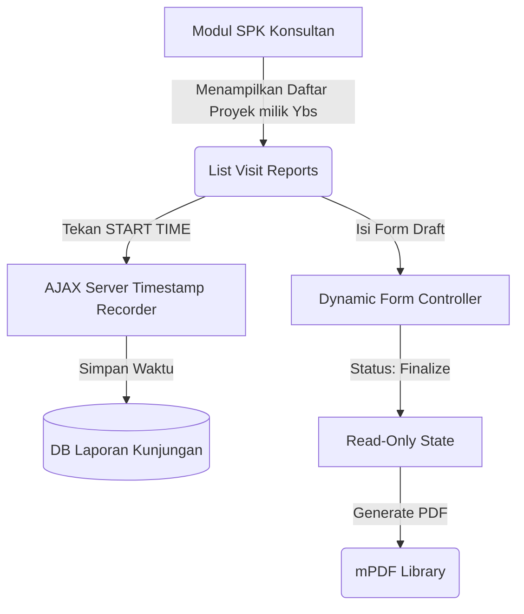

# System Design Document: Modul Laporan Kunjungan

## 1. Context & Goals
**Background Singkat:** 
Tidak adanya penjejakan log presensi harian konsultan saat bertugas *on-site* di lokasi klien memicu sengketa penagihan *Mandays*. 
Modul Laporan Kunjungan diciptakan agar proses "Absensi" (Start/Finish) dan penulisan Rencana Tindak Lanjut (*Action Plan*) tercatat resmi pada peladen (server) dengan dokumen *output* berupa PDF.

**Out of Scope:** 
Fitur *Geo-tagging* GPS atau *Selfie Location* tidak dimasukkan dalam fase rilis pertama (dianggap di luar lingkup teknis saat ini).

---

## 2. Proposed Architecture
**Architecture Diagram:**


**Component Breakdown:**
- **Time Recorder API:** Sebuah *function* khusus (`record_time()`) yang dipanggil via AJAX untuk mengekstrak jam server secara mutlak (`date('Y-m-d H:i:s')`), guna mencegah manipulasi jam di perangkat klien.
- **Laporan Kunjungan Controller:** Pengontrol utama untuk menyimpan rincian *Activities*, *Action Plans*, dan *Improvements* (Format Master-Detail).

---

## 3. Data Model & Storage
**Schema Database (ERD Singkat):**
- **`visit_report_headers`**: `report_id` (PK), `id_spk_penawaran`, `consultant_id`, `start_time`, `finish_time`, `status` (Draft/Final).
- **`visit_report_activities`**: Rincian kegiatan harian.
- **`visit_report_action_plans`**: *To-Do list* pasca kunjungan (memiliki target tanggal penyelesaian).
- **`visit_report_improvements`**: Potensi perbaikan Klien.

**Caching Strategy:**
- Tidak ada *cache*.

---

## 4. Interface Definitions (API Contract)
**A. Timestamp Recorder (Start / Finish)**
- **Endpoint:** `POST /laporan_kunjungan/record_time`
- **Request Payload:**
  ```json
  {
    "report_id": "VR-2607-001",
    "type": "start" // atau "finish"
  }
  ```
- **Response Payload:**
  ```json
  {
    "status": 1,
    "timestamp": "2026-07-09 08:00:00"
  }
  ```

---

## 5. Non-Functional Requirements & Trade-offs
**Scalability & Performance:**
- Menarik *Historical Data* (Contoh: Menarik status Action Plan yang belum selesai dari Laporan Kunjungan minggu lalu) harus dilakukan dengan se-efisien mungkin menggunakan `JOIN` sederhana, karena akan diload pada saat *User* membuka form draf baru.

**Security:**
- **Anti-Hijack Logic:** Terdapat fungsi pembatas (`$this->auth->user_id()`) di dalam *Controller*. Jika seorang *User ID 12* mencoba membuka *URL Edit* milik *User ID 50*, maka sistem akan memblokir dan mengarahkan kembali ke dasbor (*Force Redirect*).
- **Finality State:** Jika `status == 'final'`, fungsi *Update/Save* akan di- *disabled* selamanya, kecuali lewat injeksi database langsung oleh *Database Administrator* (DBA).

**Trade-offs:**
- Pembuatan laporan menggunakan *Single Page Dynamic Form* (*jQuery append row*). Pendekatan ini bagus untuk UX di *desktop/tablet*, tapi bisa membuat *scrolling* agak panjang di *smartphone*. Solusinya adalah membagi form dalam struktur *Accordion* di versi selanjutnya.

---

## 6. Infrastructure & Deployment Impact
**Infrastructure Changes:**
- Server harus dipastikan menggunakan zona waktu (Timezone) *Asia/Jakarta* (WIB) secara *default* (`date_default_timezone_set('Asia/Jakarta')`) di indeks agar *Timestamp* kunjungan tidak melenceng.

**Migration Plan:**
- Standar DDL *script* untuk tabel kunjungan (*Headers & Detail*).
