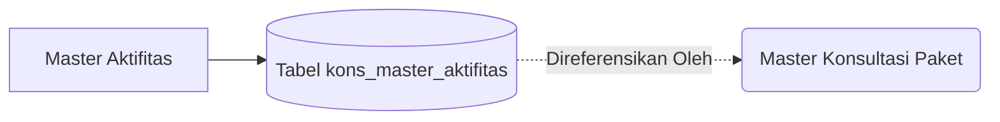

# System Design Document: Modul Master Aktifitas

## 1. Context & Goals
**Background Singkat:** 
Menstandarisasi daftar istilah/kegiatan teknis proyek agar Konsultan Lapangan mengisi absen harian (*Visit Report*) dengan nomenklatur baku yang dikenali sistem.

**Out of Scope:** 
Pemberian harga per aktifitas harian (Biaya honor ditetapkan per Proyek, bukan per aktifitas teknis).

---

## 2. Proposed Architecture
**Architecture Diagram:**

**Component Breakdown:**
- **Master Aktifitas Controller:** Menambahkan / merubah nama list aktifitas.

---

## 3. Data Model & Storage
**Schema Database (ERD Singkat):**
- **`kons_master_aktifitas`**: `id_aktifitas` (PK), `nm_aktifitas`, `keterangan`.

**Caching Strategy:**
- Tidak menggunakan Redis. *Live Data* ke MySQL.

---

## 4. Interface Definitions (API Contract)
- **Endpoint:** `POST /master_aktifitas/add` (Via AJAX)
- Mengembalikan response JSON standar `status: 1`.

---

## 5. Non-Functional Requirements & Trade-offs
**Security & Integrity:**
- Metode penghapusan menggunakan *Soft Delete* agar tidak merusak laporan harian (Visit Report) lama yang mendompleng ID Aktifitas tersebut.

---

## 6. Infrastructure & Deployment Impact
**Migration Plan:** Eksekusi standar SQL DDL.
