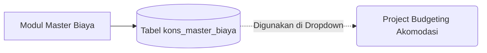

# System Design Document: Modul Master Biaya

## 1. Context & Goals
**Background Singkat:** 
Modul untuk membakukan *list* "Pos Pengeluaran Beban". Digunakan untuk mengelompokkan kategori pada Modul *Project Budgeting* (Akomodasi vs Beban Lain-lain/Others).

**Out of Scope:** 
Tidak melakukan pemetaan otomatis ke Modul Keuangan Besar (*General Ledger/ERP Accounting*). 

---

## 2. Proposed Architecture
**Architecture Diagram:**

**Component Breakdown:**
- **Controller Biaya:** *Basic MVC Entity Manager*.

---

## 3. Data Model & Storage
**Schema Database (ERD Singkat):**
- **`kons_master_biaya`**: `id_biaya` (PK), `nm_biaya` (Contoh: "Tiket Kereta"), `kategori` (Enum: Akomodasi/Others), `sts_aktif`.

**Caching Strategy:**
- Tidak ada kuki / cache memori.

---

## 4. Interface Definitions (API Contract)
- **Endpoint:** `POST /master_biaya/add` (Ajax Form submit).
- **Response:** JSON format `{ status: 1, pesan: 'Berhasil' }`.

---

## 5. Non-Functional Requirements & Trade-offs
**Security:**
- Penghapusan (*Soft Delete*) jika item pengeluaran ini sudah tidak digunakan lagi untuk penagihan/anggaran.

**Trade-offs:**
- Membedakan 'Akomodasi' dan 'Others' menggunakan kolom Enum (String Flagging) alih-alih membuat dua tabel berbeda.
  *Keuntungan:* Manajemen data (CRUD) hanya butuh 1 halaman. Kueri dari Modul Penawaran bisa di-*filter* dinamis memakai klausa `WHERE kategori='Akomodasi'`.

---

## 6. Infrastructure & Deployment Impact
**Migration Plan:** 
Eksekusi Script DDL `kons_master_biaya`.
