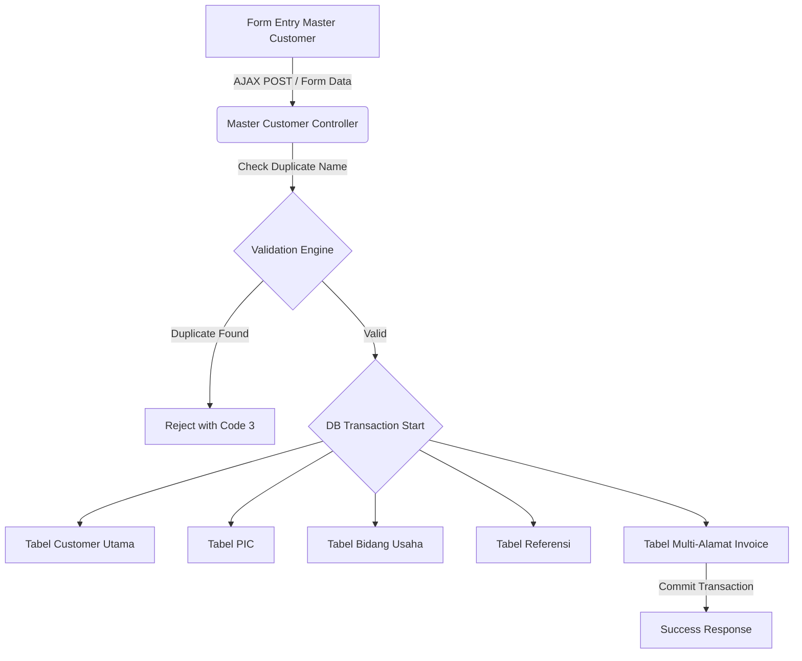

# System Design Document: Modul Master Customer

## 1. Context & Goals
**Background Singkat:** 
Data klien perlu menjadi satu kesatuan pusat (Single Source of Truth). Sebelumnya, data sering terduplikasi karena sedikit salah pengetikan nama (typo), serta kesulitan jika 1 Perusahaan Klien (PT) meminta pengiriman nota tagihan ke berbagai alamat operasional (Multi-Address Invoicing).

**Out of Scope:** 
Sistem ini tidak memuat struktur perusahaan *Parent/Holding* dan *Child/Branch*. Semuanya diperlakukan *Flat Entity*.

---

## 2. Proposed Architecture
**Architecture Diagram:**


**Component Breakdown:**
- **Validation Engine:** Sebuah proses *Pre-Flight* di *Controller* yang melakukan pencarian nama klien (menggunakan konversi *strtoupper* untuk abaikan kapitalisasi) dan pencarian *Email/HP* pada *PIC* (dengan menghapus tanda hubung `-` via *Regex/String Replace*).
- **ID Generator Engine:** Logika pembedahan *String* menggunakan fungsi SQL (`MAX(id_customer)`) ditambah parameter tahun-bulan (`YM`) untuk men-*generate* nomor antrean klien secara unik.

---

## 3. Data Model & Storage
**Schema Database (ERD Singkat):**
- **`customer`**: Data PT/Profil Induk. (PK: `id_customer` misal `C100-2607001`).
- **`customer_pic`**: Data Kontak Personal / B2B Liason. (PK: `id_pic` misal `PIC-2607001`).
- **`customer_address_invoice`**: Tabel yang memetakan banyak alamat ke 1 ID Customer.
*(Total 5 tabel digunakan untuk menjabarkan 1 profil entitas)*.

**Caching Strategy:**
- Tidak menggunakan kuki (cookies) atau *Redis*. Master data di-muat secara langsung melalui Kueri *Datatables*.

---

## 4. Interface Definitions (API Contract)
**A. Dependent Dropdown (Provinsi -> Kota)**
- **Endpoint:** `POST /master_customer/getDistrict`
- **Request Payload:**
  ```json
  {
    "id_prov": "31" // Kode Provinsi DKI Jakarta
  }
  ```
- **Response Payload:** (Mengembalikan string tag HTML `<option>`)
  ```json
  {
    "option": "<option value='3171'>Jakarta Selatan</option>..."
  }
  ```

---

## 5. Non-Functional Requirements & Trade-offs
**Scalability & Performance:**
- Penulisan (Insert) profil klien baru melibatkan 5 tabel sekaligus. Proses ini berisiko menghasilkan *Orphaned Data* jika koneksi terputus di tengah jalan.
- **Solusi Kritis:** Pembungkusan eksekusi dengan `db->trans_start()` hingga `db->trans_complete()`. Jika terjadi galat, data batal masuk seutuhnya (*Rollback*).

**Security:**
- Validasi ketat untuk tidak menghapus secara fisik (*Soft Delete*). Jika data dihapus, hanya merubah kolom `deleted_date` agar historis *Quotation* dan *SPK* lama tidak rusak.

**Trade-offs:**
- Pemisahan alamat penagihan (*Address Invoice*) ke dalam tabel terpisah *1-to-Many* menambah kompleksitas kueri (diperlukan `where_not_in` saat proses Update data alamat yang dihapus dari UI). Keuntungannya, form input tagihan di modul *Finance* akan sangat rapi karena dapat merender pilihan *dropdown* lokasi penagihan secara dinamis.

---

## 6. Infrastructure & Deployment Impact
**Infrastructure Changes:**
- -

**Migration Plan:**
- Relasi konvensional DDL. Pembuatan 5 tabel entitas Master Customer dijalankan melalui *script runner*.
