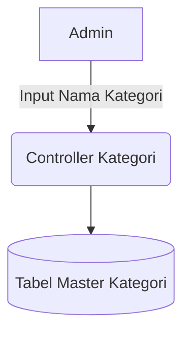

# System Design Document: Modul Master Kategori

## 1. Context & Goals
**Background Singkat:** 
Produk / Jasa yang dijual oleh konsultan harus dikelompokkan agar laporannya bisa diagregasi (Contoh: "Pelatihan vs Sertifikasi ISO"). 

**Out of Scope:** 
Pemetaan pajak (*Tax mapping*) per kategori layanan.

---

## 2. Proposed Architecture
**Architecture Diagram:**

**Component Breakdown:**
- **Controller Kategori:** CRUD sederhana.

---

## 3. Data Model & Storage
**Schema Database (ERD Singkat):**
- **`kons_master_kategori`**: `id_kategori` (PK), `nm_kategori`, `sts_aktif` (Flag 'Y' / 'N').

**Caching Strategy:**
- Akses ke DB secara langsung tanpa memori *cache*.

---

## 4. Interface Definitions (API Contract)
*(Menggunakan AJAX POST standar)*
- **Request:** `{"nm_kategori": "Konsultasi Lingkungan"}`
- **Response:** `{"status": 1, "pesan": "Success"}`

---

## 5. Non-Functional Requirements & Trade-offs
**Scalability & Performance:**
- Terdapat puluhan baris data (Sangat Ringan).

**Trade-offs:**
- Master Kategori dibiarkan bebas tanpa ID Kategorisasi turunan (Bukan format *tree-node* bersarang), semata-mata agar *Dropdown* di modul Penawaran jauh lebih mudah dikoding dan dicari oleh pengguna.

---

## 6. Infrastructure & Deployment Impact
**Migration Plan:** Standar DDL *script* untuk `CREATE TABLE`.
