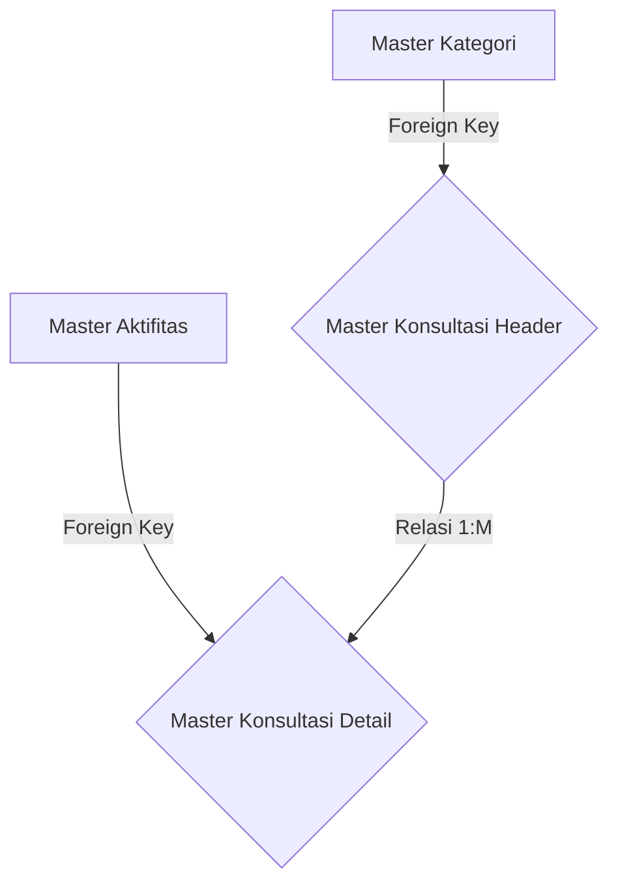

# System Design Document: Modul Master Konsultasi (Paket)

## 1. Context & Goals
**Background Singkat:** 
Paket layanan tidak boleh diketik dari awal (*from scratch*) oleh tim Sales di Modul Penawaran karena akan memakan waktu. Modul ini merakit 1 Kategori Jasa dengan N-Aktifitas yang menjadi bundel *Default* / Modul Tempelan Penawaran.

**Out of Scope:** 
Fitur penentuan diskon atau total harga jual paket. (Harga didefinisikan di saat pembuatan Quotation).

---

## 2. Proposed Architecture
**Architecture Diagram:**


**Component Breakdown:**
- **Controller Paket:** Membaca array input dari UI, membaginya ke insert Header tabel, dan `insert_batch` ke Detail tabel.
- **Relational View Engine:** Merangkai list dari Kategori dan Aktifitas untuk bahan *Dropdown UI*.

---

## 3. Data Model & Storage
**Schema Database (ERD Singkat):**
- **`kons_master_konsultasi_header`**: `id_konsultasi_h` (PK), `id_kategori` (FK), `nm_paket`.
- **`kons_master_konsultasi_detail`**: `id_konsultasi_d` (PK), `id_konsultasi_h` (FK), `id_aktifitas`, `mandays_default`.

**Caching Strategy:**
- Tanpa cache khusus.

---

## 4. Interface Definitions (API Contract)
**A. Submit Paket (Header + Array Details)**
- **Request Payload:**
  ```json
  {
    "id_kategori": "KAT-01",
    "nm_paket": "ISO 9001 Full Service",
    "detail[0][id_aktifitas]": "ACT-10",
    "detail[0][mandays_default]": "2"
  }
  ```

---

## 5. Non-Functional Requirements & Trade-offs
**Scalability & Performance:**
- Wajib menggunakan blok `db->trans_start()` saat menyimpan karena ini melibatkan relasi kompleks Header-Detail. Jika salah satu insert gagal, dibatalkan semua (*Rollback*).

**Trade-offs:**
- Di UI, Admin dimungkinkan membuat paket yang kosong aktifitas (Detail = 0). Walaupun anomali, sistem *Backend* dirancang memaklumi asalkan Header dimasukkan dengan baik. Logika validasi "Wajib punya 1 aktifitas" di-lempar ke ranah validasi Form Javascript (UI).

---

## 6. Infrastructure & Deployment Impact
**Migration Plan:** DDL pembuatan 2 Tabel relasional.
