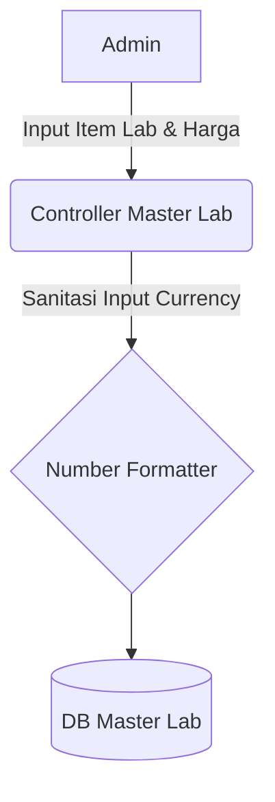

# System Design Document: Modul Master Lab

## 1. Context & Goals
**Background Singkat:** 
Biaya variabel seperti uji lab lingkungan (Emisi udara, limbah cair) sangat memengaruhi margin. Agar nilai *budgeting* akurat, harga setiap parameter uji wajib disetel pada Master Lab dan digunakan secara sentral di Modul Penawaran dan Modul Project Budgeting.

**Out of Scope:** 
Fitur API eksternal (*Webhooks*) untuk mengambil harga *live* langsung dari mesin *server* laboratorium rekanan (Belum diperlukan).

---

## 2. Proposed Architecture
**Architecture Diagram:**


**Component Breakdown:**
- **Master Lab Controller:** Form entry standar. 
- **Currency Sanitizer:** Fitur di level *Controller* / *Frontend JS* yang membersihkan teks Rupiah (misal `1.500.000` menjadi `1500000`) sebelum disimpan ke SQL (`INT` / `DECIMAL`).

---

## 3. Data Model & Storage
**Schema Database (ERD Singkat):**
- **`kons_master_lab`**: `id_lab` (PK), `nama_pengujian`, `harga`, `sts_aktif`.

**Caching Strategy:**
- Tanpa *cache*, karena pembacaan data ini umumnya via *dropdown ajax search* saat menyusun SPK.

---

## 4. Interface Definitions (API Contract)
*(Menggunakan AJAX POST standar)*
- **Request Payload:**
  ```json
  {
    "nama_pengujian": "Uji Emisi Kendaraan",
    "harga": 500000
  }
  ```
- **Response Payload:** `status: 1`

---

## 5. Non-Functional Requirements & Trade-offs
**Scalability & Performance:**
- *DataTables Server-side Rendering* wajib diimplementasi jika data item uji lab mencapai > 10.000 baris.

**Trade-offs:**
- Menyimpan harga *default* di master tabel:
  *Kekurangan:* Harga *real-time* lab eksternal bisa berubah mendadak, membuat harga *default* ini basi (*Stale Data*). 
  *Kelebihan:* Membuat draf Penawaran jauh lebih cepat tanpa harus selalu menelepon lab eksternal. (Bila harga berbeda saat operasi riil, *Project Manager* bisa memanfaatkan jalur Modul OVB / Overbudget).

---

## 6. Infrastructure & Deployment Impact
**Migration Plan:** 
DDL *script* Tabel Tunggal.
