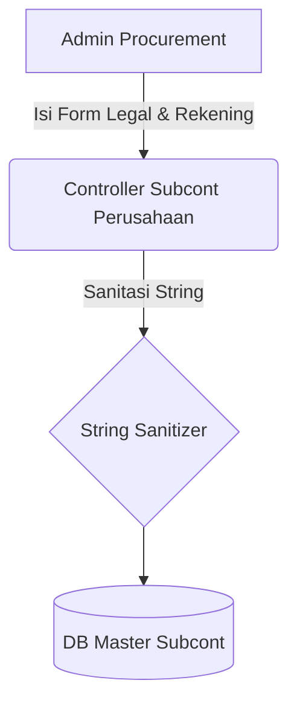

# System Design Document: Modul Master Subcont Perusahaan

## 1. Context & Goals
**Background Singkat:** 
Berbeda dengan Tenaga Ahli (Personal), sistem juga membutuhkan entitas *Subcont B2B* (Mitra/Vendor Badan Usaha) untuk keperluan pekerjaan *outsourcing*. Memusatkan rekening Vendor agar terhindar dari salah transfer/sengketa pajak (NPWP).

**Out of Scope:** 
Sistem pelacakan utang-piutang (*Account Payable*) tingkat lanjut. Fitur AP akan dipisah di luar *scope* Konsultan Sistem.

---

## 2. Proposed Architecture
**Architecture Diagram:**


**Component Breakdown:**
- **Controller Subcont:** Logika standar CRUD Master-Level B2B. Melakukan sanitasi penulisan nama PT dan pengecekan Duplikasi agar nama PT yang sama tidak masuk dua kali.

---

## 3. Data Model & Storage
**Schema Database (ERD Singkat):**
- **`kons_master_subcont_perusahaan`**: `id` (PK), `nm_vendor` (PT. XXX), `npwp`, `alamat`, `pic`, `hp`, `bank_name`, `no_rekening`.

**Caching Strategy:**
- Tidak menggunakan Redis.

---

## 4. Interface Definitions (API Contract)
**A. Create Vendor Data**
- **Request Payload:**
  ```json
  {
    "nm_vendor": "PT Subcont Maju",
    "pic": "Rio",
    "hp": "08123456",
    "npwp": "99.xxx.xxx",
    "bank_name": "Mandiri",
    "no_rekening": "123-456"
  }
  ```

---

## 5. Non-Functional Requirements & Trade-offs
**Scalability & Performance:**
- Sangat *lightweight*. Jumlah baris sub-kontraktor umumnya jauh lebih sedikit (belasan - puluhan data) dibandingkan *Customer*.

**Security:**
- Proses penolakan *Soft-Delete* (*Restrict Dependency*) bila `id_vendor` ini sudah terlanjur dialokasikan di dalam tabel Kasbon/Realisasi Expense Report yang sedang berjalan (Mencegah *Orphaned Account Payable*).

**Trade-offs:**
- Kenapa entitas Vendor tidak dicampur dalam *Master Customer* dengan label `type = vendor`? 
  *Penjelasan Arsitektural:* Customer dipenuhi banyak data relasional (banyak alamat *invoice*, bidang usaha, dll), sedangkan profil Vendor sengaja dibuat *flat* dan lurus karena operasional Procurement jauh lebih *straightforward* dibanding Sales.

---

## 6. Infrastructure & Deployment Impact
**Migration Plan:** 
DDL Script `CREATE TABLE` tunggal.
