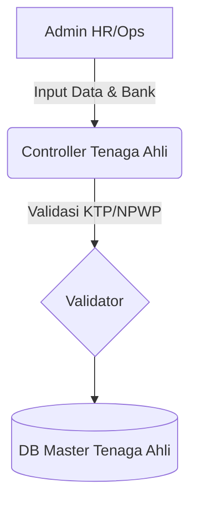

# System Design Document: Modul Master Tenaga Ahli

## 1. Context & Goals
**Background Singkat:** 
Menghimpun *Freelance Expert* (Tenaga Ahli) agar mudah ditugaskan (Assign) pada proyek-proyek spesifik. Modul ini wajib mencatat Tarif Harian (Mandays Rate) dan Nomor Rekening mereka untuk pembayaran *honorarium*.

**Out of Scope:** 
Tidak ada fitur *Login Portal* bagi tenaga ahli tersebut. Seluruh *data entry* diinput oleh internal HR/Admin Perusahaan.

---

## 2. Proposed Architecture
**Architecture Diagram:**


**Component Breakdown:**
- **Validator KTP & Rekening:** Memastikan bahwa NPWP terisi dan No Rekening bersih dari karakter *spasi* atau *strip (-)* saat disimpan di tabel.

---

## 3. Data Model & Storage
**Schema Database (ERD Singkat):**
- **`kons_master_tenaga_ahli`**: `id` (PK), `nama`, `ktp`, `npwp`, `mandays_rate` (Decimal), `bank_name`, `no_rekening`, `sts_aktif`.

**Caching Strategy:**
- Tidak menggunakan Redis. Kueri *live* untuk antisipasi pergantian rekening bank secara instan.

---

## 4. Interface Definitions (API Contract)
**A. Submit Ahli**
- **Endpoint:** `POST /master_tenaga_ahli/add`
- **Request Payload:**
  ```json
  {
    "nama": "Budi Raharjo",
    "ktp": "3171...",
    "npwp": "02.xxx.xxx",
    "mandays_rate": "1500000",
    "bank_name": "BCA",
    "no_rekening": "12345678"
  }
  ```

---

## 5. Non-Functional Requirements & Trade-offs
**Security:**
- Form ini menyimpan *Data Sensitif* (PII - Personally Identifiable Information). Akses form (baik *Read* maupun *Write*) dibatasi hanya kepada peran *HR* dan *Finance* (RBAC ketat pada fungsi pembacaan data, men-sensor No Rekening untuk user biasa).

**Trade-offs:**
- Sengaja **memisahkan** Master Tenaga Ahli dari Master Karyawan (Employees). 
  *Alasan:* Struktur gaji mereka berbeda (Honor vs Gaji Tetap), Tenaga Ahli tidak memiliki Hak Akses Login ke sistem (Bukan User), serta cara perhitungan penugasan mereka masuk dalam ranah *Sub-Contract*, bukan Beban Operasional Perusahaan (OPEX).

---

## 6. Infrastructure & Deployment Impact
**Migration Plan:** 
Buat DDL Tabel `kons_master_tenaga_ahli` dengan enkripsi TLS/SSL (HTTPS) pada server untuk pengiriman KTP dan Nomor Rekening.
