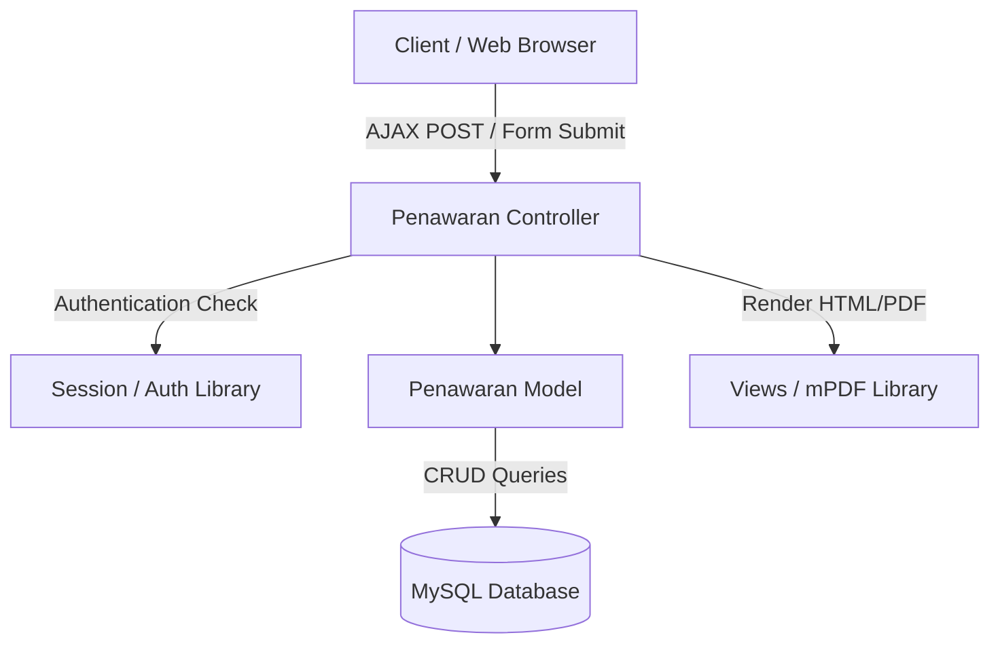

# System Design Document: Modul Penawaran

## 1. Context & Goals
**Background Singkat:** 
Proses penawaran harga kepada klien sebelumnya dikerjakan di luar sistem. Akibatnya, sulit melacak sejarah (revisi) dokumen dan sering terjadi kesalahan pada total kalkulasi margin/diskon. Modul ini bertujuan mendigitalisasi proses pembuatan draf hingga persetujuan Penawaran (Quotation) menjadi sistem pencatatan satu pintu.

**Out of Scope:** 
Modul ini tidak mencakup pembentukan *Surat Perintah Kerja (SPK)* (dipisah di modul SPK) dan tidak menyentuh area pembuatan *Invoice* / Penagihan (dipisah di modul Akuntansi).

---

## 2. Proposed Architecture
**Architecture Diagram:**


**Component Breakdown:**
- **Penawaran (Controller):** Menangani *request routing*, validasi input, serta konversi dokumen HTML menjadi PDF.
- **Penawaran_model (Model):** Mengabstraksi fungsi penyimpanan (*insert/update/delete*) ke dalam bentuk relasi *Master-Detail*.
- **mPDF / TCPDF (Third Party):** Komponen eksternal yang dipanggil *Controller* untuk mencetak Quotation ke format PDF yang memiliki Header dan Footer perusahaan.

---

## 3. Data Model & Storage
**Schema Database (ERD Singkat):**
- **`kons_tr_penawaran` (Header):** `id_quotation` (PK), `id_customer`, `total_nilai`, `status` (Draft/Waiting/Approved).
- **`kons_tr_penawaran_detail` (Line Items):** `id_detail` (PK), `id_quotation` (FK), `item_desc`, `qty`, `harga`, `total`.
- **`kons_tr_penawaran_history` (Versioning):** Duplikasi skema *Header* untuk menyimpan catatan revisi (*Snapshot data*).

**Caching Strategy:**
- Mengingat perbaruan penawaran terjadi secara *real-time* dan membutuhkan data mutakhir (tanpa *lag* harga), **tidak ada mekanisme caching** (No Redis/Memcached) di *layer database*. Sistem mengandalkan koneksi SQL secara langsung (Direct Query).

---

## 4. Interface Definitions (API Contract)
*(Menggunakan Endpoint AJAX / MVC CodeIgniter)*

**A. Create/Update Penawaran**
- **Endpoint:** `POST /penawaran/save`
- **Request Payload (Form Data):**
  ```json
  {
    "id_customer": "C100-2607001",
    "tanggal_penawaran": "2026-07-09",
    "detail_items[0][id_item]": "ITM-01",
    "detail_items[0][qty]": "2",
    "detail_items[0][price]": "5000000"
  }
  ```
- **Response Payload:**
  ```json
  {
    "status": 1,
    "pesan": "Save Penawaran Success"
  }
  ```

---

## 5. Non-Functional Requirements & Trade-offs
**Scalability & Performance:**
- **Throughput:** Sistem ini tergolong *Low QPS* (Queries Per Second) karena hanya digunakan oleh internal Sales. Beban utama terletak pada fungsi *Generate PDF* yang membutuhkan memori agak besar (~30MB per proses rendering PDF).
- **Security:** Modul ini memvalidasi *Session Role* (Hanya pembuat dan Manajer yang boleh membuka penawarannya sendiri).

**Trade-offs:**
- **Monolithic over Microservices:** Memilih membangun Modul Penawaran di dalam sistem monolitik agar *join query* ke tabel `Customer` dan `Employee` (Sales) lebih cepat ketimbang memanggilnya melalui jaringan API, mempercepat fase *development*.

---

## 6. Infrastructure & Deployment Impact
**Infrastructure Changes:**
- Tidak ada tambahan infrastruktur server baru. Hanya diperlukan instalasi pustaka PHP (`mPDF`) jika belum ada di `vendor/`.

**Migration Plan:**
- Skrip migrasi DDL (`CREATE TABLE kons_tr_penawaran...`) dijalankan pada saat sistem *maintenance window*. Tidak ada *downtime* pada data user lama karena ini adalah struktur tabel baru.
