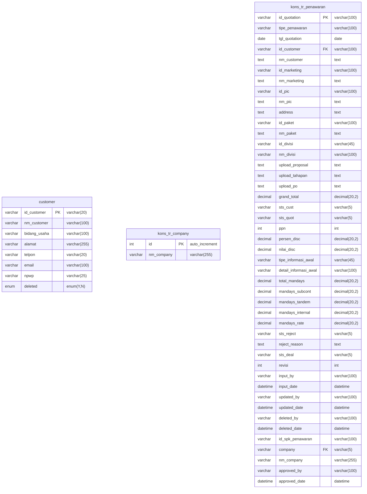

# ERD Database - Modul Penawaran & Approval Penawaran

## Informasi Koneksi Database

- **Host:** mysql8 (Docker)
- **Port:** 3307
- **Database:** db_consultant_new
- **Driver:** mysqli
- **User:** root

---

## Daftar Tabel

### Tabel Utama (Transaksi)

| No  | Nama Tabel                                | Deskripsi                             |
| --- | ----------------------------------------- | ------------------------------------- |
| 1   | `kons_tr_penawaran`                       | Header penawaran konsultasi           |
| 2   | `kons_tr_penawaran_non_konsultasi`        | Header penawaran non-konsultasi       |
| 3   | `kons_tr_detail_penawaran_non_konsultasi` | Detail item penawaran non-konsultasi  |
| 4   | `kons_tr_penawaran_aktifitas`             | Detail aktifitas penawaran konsultasi |
| 5   | `kons_tr_penawaran_akomodasi`             | Detail biaya akomodasi penawaran      |
| 6   | `kons_tr_penawaran_others`                | Detail biaya lain-lain penawaran      |
| 7   | `kons_tr_penawaran_lab`                   | Detail biaya laboratorium penawaran   |
| 8   | `kons_tr_penawaran_subcont_tenaga_ahli`   | Detail subcont tenaga ahli            |
| 9   | `kons_tr_penawaran_subcont_perusahaan`    | Detail subcont perusahaan             |

### Tabel History (Audit Trail)

| No  | Nama Tabel                                      | Deskripsi                           |
| --- | ----------------------------------------------- | ----------------------------------- |
| 10  | `kons_tr_penawaran_history`                     | History revisi penawaran konsultasi |
| 11  | `kons_tr_penawaran_aktifitas_history`           | History aktifitas penawaran         |
| 12  | `kons_tr_penawaran_akomodasi_history`           | History akomodasi penawaran         |
| 13  | `kons_tr_penawaran_others_history`              | History biaya lain-lain             |
| 14  | `kons_tr_penawaran_lab_history`                 | History biaya laboratorium          |
| 15  | `kons_tr_penawaran_subcont_tenaga_ahli_history` | History subcont tenaga ahli         |
| 16  | `kons_tr_penawaran_subcont_perusahaan_history`  | History subcont perusahaan          |

### Tabel Master (Referensi)

| No  | Nama Tabel        | Deskripsi                      |
| --- | ----------------- | ------------------------------ |
| 17  | `customer`        | Master data customer           |
| 18  | `kons_tr_company` | Master data company/perusahaan |

---

## ERD Diagram (Mermaid)



    %% ========== PENAWARAN NON-KONSULTASI ==========
    kons_tr_penawaran_non_konsultasi {
        varchar id_penawaran PK "varchar(100)"
        date tgl_quotation "date"
        varchar id_customer FK "varchar(100)"
        text nm_customer "text"
        varchar pic "varchar(255)"
        varchar nm_pic_penawaran "varchar(255)"
        varchar id_divisi "varchar(100)"
        text nm_divisi "text"
        varchar id_company FK "varchar(100)"
        text nm_company "text"
        text address "text"
        varchar pic_penawaran "varchar(255)"
        varchar tipe_informasi_awal "varchar(100)"
        varchar detail_informasi_awal "varchar(100)"
        text keterangan_penawaran "text"
        decimal subtotal "decimal(20,2)"
        decimal ppn "decimal(20,2)"
        decimal grand_total "decimal(20,2)"
        text dokumen_pendukung "text"
        varchar sts_quot "varchar(5)"
        text reject_reason "text"
        varchar sts_deal "varchar(5)"
        varchar input_by "varchar(100)"
        datetime input_date "datetime"
        varchar updated_by "varchar(100)"
        datetime updated_date "datetime"
        varchar approved_by "varchar(50)"
        datetime approved_date "datetime"
        varchar deleted_by "varchar(100)"
        datetime deleted_date "datetime"
        decimal biaya_kirim "decimal(20,2)"
        decimal nominal_disc "decimal(20,2)"
        decimal persen_disc "decimal(20,2)"
        decimal persen_ppn "decimal(20,2)"
        enum sts_close "enum(0,1)"
    }

    kons_tr_detail_penawaran_non_konsultasi {
        int id PK "auto_increment"
        varchar id_header FK "varchar(100)"
        text nm_item "text"
        decimal qty "decimal(20,2)"
        decimal harga "decimal(20,2)"
        decimal total "decimal(20,2)"
        varchar input_by "varchar(100)"
        datetime input_at "datetime"
    }

    %% ========== DETAIL PENAWARAN KONSULTASI ==========
    kons_tr_penawaran_aktifitas {
        int id PK "auto_increment"
        varchar id_penawaran FK "varchar(100)"
        varchar id_aktifitas "varchar(100)"
        text nm_aktifitas "text"
        decimal bobot "decimal(20,2)"
        decimal mandays "decimal(20,2)"
        decimal mandays_rate "decimal(20,2)"
        decimal mandays_subcont "decimal(20,2)"
        decimal mandays_rate_subcont "decimal(20,2)"
        decimal mandays_tandem "decimal(20,2)"
        decimal mandays_rate_tandem "decimal(20,2)"
        decimal harga_aktifitas "decimal(20,2)"
        decimal total_aktifitas "decimal(20,2)"
        varchar input_by "varchar(100)"
        datetime input_date "datetime"
    }

    kons_tr_penawaran_akomodasi {
        int id PK "auto_increment"
        varchar id_penawaran FK "varchar(100)"
        varchar id_item "varchar(100)"
        text nm_item "text"
        decimal qty "decimal(20,2)"
        decimal price_unit "decimal(20,2)"
        decimal total "decimal(20,2)"
        text keterangan "text"
        varchar input_by "varchar(100)"
        datetime input_date "datetime"
    }

    kons_tr_penawaran_others {
        int id PK "auto_increment"
        varchar id_penawaran FK "varchar(100)"
        varchar id_item "varchar(100)"
        text nm_item "text"
        decimal qty "decimal(20,2)"
        decimal price_unit "decimal(20,2)"
        decimal total "decimal(20,2)"
        decimal price_unit_budget "decimal(20,2)"
        decimal total_budget "decimal(20,2)"
        text keterangan "text"
        varchar input_by "varchar(100)"
        datetime input_date "datetime"
    }

    kons_tr_penawaran_lab {
        int id PK "auto_increment"
        varchar id_penawaran FK "varchar(100)"
        varchar id_item "varchar(100)"
        text nm_item "text"
        decimal qty "decimal(20,2)"
        decimal price_unit "decimal(20,2)"
        decimal total "decimal(20,2)"
        decimal price_unit_budget "decimal(20,2)"
        decimal total_budget "decimal(20,2)"
        text keterangan "text"
        varchar input_by "varchar(100)"
        datetime input_date "datetime"
    }

    kons_tr_penawaran_subcont_tenaga_ahli {
        int id PK "auto_increment"
        varchar id_penawaran FK "varchar(100)"
        varchar id_item "varchar(100)"
        text nm_item "text"
        decimal qty "decimal(20,2)"
        decimal price_unit "decimal(20,2)"
        decimal total "decimal(20,2)"
        decimal price_unit_budget "decimal(20,2)"
        decimal total_budget "decimal(20,2)"
        text keterangan "text"
        varchar input_by "varchar(100)"
        datetime input_date "datetime"
    }

    kons_tr_penawaran_subcont_perusahaan {
        int id PK "auto_increment"
        varchar id_penawaran FK "varchar(100)"
        varchar id_item "varchar(100)"
        text nm_item "text"
        decimal qty "decimal(20,2)"
        decimal price_unit "decimal(20,2)"
        decimal total "decimal(20,2)"
        decimal price_unit_budget "decimal(20,2)"
        decimal total_budget "decimal(20,2)"
        text keterangan "text"
        varchar input_by "varchar(100)"
        datetime input_date "datetime"
    }

    %% ========== HISTORY TABLES ==========
    kons_tr_penawaran_history {
        varchar id_history PK "varchar(100)"
        varchar id_quotation FK "varchar(100)"
        varchar tipe_penawaran "varchar(100)"
        date tgl_quotation "date"
        varchar id_customer "varchar(100)"
        text nm_customer "text"
        varchar id_marketing "varchar(100)"
        text nm_marketing "text"
        varchar id_pic "varchar(100)"
        text nm_pic "text"
        text address "text"
        varchar id_paket "varchar(100)"
        text nm_paket "text"
        varchar id_divisi "varchar(45)"
        varchar nm_divisi "varchar(100)"
        decimal grand_total "decimal(20,2)"
        varchar sts_quot "varchar(5)"
        int ppn "int"
        decimal persen_disc "decimal(20,2)"
        decimal nilai_disc "decimal(20,2)"
        decimal total_mandays "decimal(20,2)"
        decimal mandays_subcont "decimal(20,2)"
        decimal mandays_tandem "decimal(20,2)"
        decimal mandays_internal "decimal(20,2)"
        decimal mandays_rate "decimal(20,2)"
        varchar sts_reject "varchar(5)"
        text reject_reason "text"
        varchar sts_deal "varchar(5)"
        int revisi "int"
        varchar input_by "varchar(100)"
        datetime input_date "datetime"
        varchar company "varchar(10)"
        varchar nm_company "varchar(255)"
    }

    kons_tr_penawaran_aktifitas_history {
        int id PK "auto_increment"
        varchar id_history FK "varchar(100)"
        int id_penawaran_aktifitas "int"
        varchar id_penawaran "varchar(100)"
        varchar id_aktifitas "varchar(100)"
        text nm_aktifitas "text"
        decimal bobot "decimal(20,2)"
        decimal mandays "decimal(20,2)"
        decimal mandays_rate "decimal(20,2)"
        decimal mandays_subcont "decimal(20,2)"
        decimal mandays_rate_subcont "decimal(20,2)"
        decimal mandays_tandem "decimal(20,2)"
        decimal mandays_rate_tandem "decimal(20,2)"
        decimal harga_aktifitas "decimal(20,2)"
        decimal total_aktifitas "decimal(20,2)"
        varchar input_by "varchar(100)"
        datetime input_date "datetime"
    }

    kons_tr_penawaran_akomodasi_history {
        int id PK "auto_increment"
        varchar id_history FK "varchar(100)"
        int id_akomodasi "int"
        varchar id_penawaran "varchar(100)"
        varchar id_item "varchar(100)"
        text nm_item "text"
        decimal qty "decimal(20,2)"
        decimal price_unit "decimal(20,2)"
        decimal total "decimal(20,2)"
        text keterangan "text"
        varchar input_by "varchar(100)"
        datetime input_date "datetime"
    }

    kons_tr_penawaran_others_history {
        int id PK "auto_increment"
        varchar id_history FK "varchar(100)"
        int id_others_penawaran "int"
        varchar id_penawaran "varchar(100)"
        varchar id_item "varchar(100)"
        text nm_item "text"
        decimal qty "decimal(20,2)"
        decimal price_unit "decimal(20,2)"
        decimal total "decimal(20,2)"
        decimal price_unit_budget "decimal(20,2)"
        decimal total_budget "decimal(20,2)"
        text keterangan "text"
        varchar input_by "varchar(100)"
        datetime input_date "datetime"
    }

    kons_tr_penawaran_lab_history {
        int id PK "auto_increment"
        varchar id_history FK "varchar(100)"
        int id_lab_penawaran "int"
        varchar id_penawaran "varchar(100)"
        varchar id_item "varchar(100)"
        text nm_item "text"
        decimal qty "decimal(20,2)"
        decimal price_unit "decimal(20,2)"
        decimal total "decimal(20,2)"
        decimal price_unit_budget "decimal(20,2)"
        decimal total_budget "decimal(20,2)"
        text keterangan "text"
        varchar input_by "varchar(100)"
        datetime input_date "datetime"
    }

    kons_tr_penawaran_subcont_tenaga_ahli_history {
        int id PK "auto_increment"
        varchar id_history FK "varchar(100)"
        int id_lab_penawaran "int"
        varchar id_penawaran "varchar(100)"
        varchar id_item "varchar(100)"
        text nm_item "text"
        decimal qty "decimal(20,2)"
        decimal price_unit "decimal(20,2)"
        decimal total "decimal(20,2)"
        decimal price_unit_budget "decimal(20,2)"
        decimal total_budget "decimal(20,2)"
        text keterangan "text"
        varchar input_by "varchar(100)"
        datetime input_date "datetime"
    }

    kons_tr_penawaran_subcont_perusahaan_history {
        int id PK "auto_increment"
        varchar id_history FK "varchar(100)"
        int id_lab_penawaran "int"
        varchar id_penawaran "varchar(100)"
        varchar id_item "varchar(100)"
        text nm_item "text"
        decimal qty "decimal(20,2)"
        decimal price_unit "decimal(20,2)"
        decimal total "decimal(20,2)"
        decimal price_unit_budget "decimal(20,2)"
        decimal total_budget "decimal(20,2)"
        text keterangan "text"
        varchar input_by "varchar(100)"
        datetime input_date "datetime"
    }

    %% ========== RELASI ==========
    %% Penawaran Konsultasi
    customer ||--o{ kons_tr_penawaran : "id_customer"
    kons_tr_penawaran ||--o{ kons_tr_penawaran_aktifitas : "id_quotation -> id_penawaran"
    kons_tr_penawaran ||--o{ kons_tr_penawaran_akomodasi : "id_quotation -> id_penawaran"
    kons_tr_penawaran ||--o{ kons_tr_penawaran_others : "id_quotation -> id_penawaran"
    kons_tr_penawaran ||--o{ kons_tr_penawaran_lab : "id_quotation -> id_penawaran"
    kons_tr_penawaran ||--o{ kons_tr_penawaran_subcont_tenaga_ahli : "id_quotation -> id_penawaran"
    kons_tr_penawaran ||--o{ kons_tr_penawaran_subcont_perusahaan : "id_quotation -> id_penawaran"

    %% Penawaran Non-Konsultasi
    customer ||--o{ kons_tr_penawaran_non_konsultasi : "id_customer"
    kons_tr_company ||--o{ kons_tr_penawaran_non_konsultasi : "id -> id_company"
    kons_tr_penawaran_non_konsultasi ||--o{ kons_tr_detail_penawaran_non_konsultasi : "id_penawaran -> id_header"

    %% History Penawaran Konsultasi
    kons_tr_penawaran ||--o{ kons_tr_penawaran_history : "id_quotation"
    kons_tr_penawaran_history ||--o{ kons_tr_penawaran_aktifitas_history : "id_history"
    kons_tr_penawaran_history ||--o{ kons_tr_penawaran_akomodasi_history : "id_history"
    kons_tr_penawaran_history ||--o{ kons_tr_penawaran_others_history : "id_history"
    kons_tr_penawaran_history ||--o{ kons_tr_penawaran_lab_history : "id_history"
    kons_tr_penawaran_history ||--o{ kons_tr_penawaran_subcont_tenaga_ahli_history : "id_history"
    kons_tr_penawaran_history ||--o{ kons_tr_penawaran_subcont_perusahaan_history : "id_history"

```

---
```

## Detail Struktur Tabel

### 1. `kons_tr_penawaran` (Header Penawaran Konsultasi)

Tabel utama untuk menyimpan data penawaran jasa konsultasi.

| Field                 | Type          | Null | Key | Default | Keterangan                   |
| --------------------- | ------------- | ---- | --- | ------- | ---------------------------- |
| id_quotation          | varchar(100)  | NO   | PRI | NULL    | Primary key, ID quotation    |
| tipe_penawaran        | varchar(100)  | NO   |     | NULL    | Tipe penawaran               |
| tgl_quotation         | date          | NO   |     | NULL    | Tanggal quotation            |
| id_customer           | varchar(100)  | NO   |     | NULL    | FK ke tabel customer         |
| nm_customer           | text          | YES  |     | NULL    | Nama customer (denormalized) |
| id_marketing          | varchar(100)  | NO   |     | NULL    | ID marketing/sales           |
| nm_marketing          | text          | YES  |     | NULL    | Nama marketing               |
| id_pic                | varchar(100)  | YES  |     | NULL    | ID PIC                       |
| nm_pic                | text          | YES  |     | NULL    | Nama PIC                     |
| address               | text          | NO   |     | NULL    | Alamat                       |
| id_paket              | varchar(100)  | NO   |     | NULL    | ID paket konsultasi          |
| nm_paket              | text          | YES  |     | NULL    | Nama paket                   |
| id_divisi             | varchar(45)   | YES  |     | NULL    | ID divisi                    |
| nm_divisi             | varchar(100)  | YES  |     | NULL    | Nama divisi                  |
| upload_proposal       | text          | YES  |     | NULL    | Path file proposal           |
| upload_tahapan        | text          | YES  |     | NULL    | Path file tahapan            |
| upload_po             | text          | YES  |     | NULL    | Path file PO                 |
| grand_total           | decimal(20,2) | NO   |     | 0.00    | Total keseluruhan            |
| sts_cust              | varchar(5)    | YES  |     | NULL    | Status customer              |
| sts_quot              | varchar(5)    | YES  |     | NULL    | Status quotation (approval)  |
| ppn                   | int           | YES  |     | NULL    | PPN percentage               |
| persen_disc           | decimal(20,2) | YES  |     | NULL    | Persentase diskon            |
| nilai_disc            | decimal(20,2) | YES  |     | NULL    | Nilai diskon                 |
| tipe_informasi_awal   | varchar(45)   | YES  |     | NULL    | Tipe informasi awal          |
| detail_informasi_awal | varchar(100)  | YES  |     | NULL    | Detail informasi awal        |
| total_mandays         | decimal(20,2) | NO   |     | 0.00    | Total mandays                |
| mandays_subcont       | decimal(20,2) | NO   |     | 0.00    | Mandays subcont              |
| mandays_tandem        | decimal(20,2) | NO   |     | 0.00    | Mandays tandem               |
| mandays_internal      | decimal(20,2) | NO   |     | 0.00    | Mandays internal             |
| mandays_rate          | decimal(20,2) | NO   |     | 0.00    | Rate per mandays             |
| sts_reject            | varchar(5)    | YES  |     | NULL    | Status reject                |
| reject_reason         | text          | YES  |     | NULL    | Alasan reject                |
| sts_deal              | varchar(5)    | YES  |     | NULL    | Status deal                  |
| revisi                | int           | NO   |     | 0       | Nomor revisi                 |
| input_by              | varchar(100)  | NO   |     | NULL    | User input                   |
| input_date            | datetime      | NO   |     | NULL    | Tanggal input                |
| updated_by            | varchar(100)  | YES  |     | NULL    | User update                  |
| updated_date          | datetime      | YES  |     | NULL    | Tanggal update               |
| deleted_by            | varchar(100)  | YES  |     | NULL    | User delete                  |
| deleted_date          | datetime      | YES  |     | NULL    | Tanggal delete               |
| id_spk_penawaran      | varchar(100)  | YES  |     | NULL    | ID SPK terkait               |
| company               | varchar(5)    | YES  |     | NULL    | Kode company                 |
| nm_company            | varchar(255)  | YES  |     | NULL    | Nama company                 |
| approved_by           | varchar(100)  | YES  |     | NULL    | User approval                |
| approved_date         | datetime      | YES  |     | NULL    | Tanggal approval             |

---

### 2. `kons_tr_penawaran_non_konsultasi` (Header Penawaran Non-Konsultasi)

Tabel utama untuk menyimpan data penawaran non-jasa konsultasi (barang/produk).

| Field                 | Type          | Null | Key | Default | Keterangan             |
| --------------------- | ------------- | ---- | --- | ------- | ---------------------- |
| id_penawaran          | varchar(100)  | NO   | PRI | NULL    | Primary key            |
| tgl_quotation         | date          | NO   |     | NULL    | Tanggal quotation      |
| id_customer           | varchar(100)  | NO   |     | NULL    | FK ke tabel customer   |
| nm_customer           | text          | YES  |     | NULL    | Nama customer          |
| pic                   | varchar(255)  | YES  |     | NULL    | PIC customer           |
| nm_pic_penawaran      | varchar(255)  | YES  |     | NULL    | Nama PIC penawaran     |
| id_divisi             | varchar(100)  | NO   |     | NULL    | ID divisi              |
| nm_divisi             | text          | NO   |     | NULL    | Nama divisi            |
| id_company            | varchar(100)  | NO   |     | NULL    | FK ke kons_tr_company  |
| nm_company            | text          | YES  |     | NULL    | Nama company           |
| address               | text          | YES  |     | NULL    | Alamat                 |
| pic_penawaran         | varchar(255)  | YES  |     | NULL    | PIC penawaran          |
| tipe_informasi_awal   | varchar(100)  | YES  |     | NULL    | Tipe informasi awal    |
| detail_informasi_awal | varchar(100)  | YES  |     | NULL    | Detail informasi awal  |
| keterangan_penawaran  | text          | YES  |     | NULL    | Keterangan penawaran   |
| subtotal              | decimal(20,2) | NO   |     | 0.00    | Subtotal               |
| ppn                   | decimal(20,2) | NO   |     | 0.00    | Nilai PPN              |
| grand_total           | decimal(20,2) | NO   |     | 0.00    | Grand total            |
| dokumen_pendukung     | text          | YES  |     | NULL    | Path dokumen pendukung |
| sts_quot              | varchar(5)    | YES  |     | NULL    | Status quotation       |
| reject_reason         | text          | NO   |     | NULL    | Alasan reject          |
| sts_deal              | varchar(5)    | YES  |     | NULL    | Status deal            |
| input_by              | varchar(100)  | NO   |     | NULL    | User input             |
| input_date            | datetime      | NO   |     | NULL    | Tanggal input          |
| updated_by            | varchar(100)  | YES  |     | NULL    | User update            |
| updated_date          | datetime      | YES  |     | NULL    | Tanggal update         |
| approved_by           | varchar(50)   | YES  |     | NULL    | User approval          |
| approved_date         | datetime      | YES  |     | NULL    | Tanggal approval       |
| deleted_by            | varchar(100)  | YES  |     | NULL    | User delete            |
| deleted_date          | datetime      | YES  |     | NULL    | Tanggal delete         |
| biaya_kirim           | decimal(20,2) | NO   |     | 0.00    | Biaya kirim            |
| nominal_disc          | decimal(20,2) | NO   |     | 0.00    | Nominal diskon         |
| persen_disc           | decimal(20,2) | NO   |     | NULL    | Persentase diskon      |
| persen_ppn            | decimal(20,2) | NO   |     | 0.00    | Persentase PPN         |
| sts_close             | enum('0','1') | NO   |     | 0       | Status close           |

---

### 3. `kons_tr_detail_penawaran_non_konsultasi` (Detail Penawaran Non-Konsultasi)

Detail item-item penawaran non-konsultasi.

| Field     | Type          | Null | Key | Default | Keterangan                             |
| --------- | ------------- | ---- | --- | ------- | -------------------------------------- |
| id        | int           | NO   | PRI | NULL    | Auto increment                         |
| id_header | varchar(100)  | NO   |     | NULL    | FK ke kons_tr_penawaran_non_konsultasi |
| nm_item   | text          | NO   |     | NULL    | Nama item                              |
| qty       | decimal(20,2) | NO   |     | 0.00    | Quantity                               |
| harga     | decimal(20,2) | NO   |     | 0.00    | Harga satuan                           |
| total     | decimal(20,2) | NO   |     | 0.00    | Total (qty x harga)                    |
| input_by  | varchar(100)  | NO   |     | NULL    | User input                             |
| input_at  | datetime      | NO   |     | NULL    | Tanggal input                          |

---

### 4. `kons_tr_penawaran_aktifitas` (Detail Aktifitas Penawaran Konsultasi)

Detail aktifitas/kegiatan yang ditawarkan dalam penawaran konsultasi.

| Field                | Type          | Null | Key | Default | Keterangan                           |
| -------------------- | ------------- | ---- | --- | ------- | ------------------------------------ |
| id                   | int           | NO   | PRI | NULL    | Auto increment                       |
| id_penawaran         | varchar(100)  | YES  |     | NULL    | FK ke kons_tr_penawaran.id_quotation |
| id_aktifitas         | varchar(100)  | YES  |     | NULL    | ID master aktifitas                  |
| nm_aktifitas         | text          | YES  |     | NULL    | Nama aktifitas                       |
| bobot                | decimal(20,2) | YES  |     | 0.00    | Bobot aktifitas (%)                  |
| mandays              | decimal(20,2) | NO   |     | 0.00    | Jumlah mandays                       |
| mandays_rate         | decimal(20,2) | NO   |     | 0.00    | Rate mandays internal                |
| mandays_subcont      | decimal(20,2) | NO   |     | NULL    | Mandays subcont                      |
| mandays_rate_subcont | decimal(20,2) | NO   |     | NULL    | Rate mandays subcont                 |
| mandays_tandem       | decimal(20,2) | NO   |     | NULL    | Mandays tandem                       |
| mandays_rate_tandem  | decimal(20,2) | NO   |     | NULL    | Rate mandays tandem                  |
| harga_aktifitas      | decimal(20,2) | NO   |     | 0.00    | Harga aktifitas                      |
| total_aktifitas      | decimal(20,2) | YES  |     | NULL    | Total aktifitas                      |
| input_by             | varchar(100)  | YES  |     | NULL    | User input                           |
| input_date           | datetime      | YES  |     | NULL    | Tanggal input                        |

---

### 5. `kons_tr_penawaran_akomodasi` (Detail Biaya Akomodasi)

Detail biaya akomodasi (transport, hotel, dll) dalam penawaran konsultasi.

| Field        | Type          | Null | Key | Default | Keterangan                           |
| ------------ | ------------- | ---- | --- | ------- | ------------------------------------ |
| id           | int           | NO   | PRI | NULL    | Auto increment                       |
| id_penawaran | varchar(100)  | YES  |     | NULL    | FK ke kons_tr_penawaran.id_quotation |
| id_item      | varchar(100)  | YES  |     | NULL    | ID item akomodasi                    |
| nm_item      | text          | YES  |     | NULL    | Nama item                            |
| qty          | decimal(20,2) | NO   |     | 0.00    | Quantity                             |
| price_unit   | decimal(20,2) | NO   |     | 0.00    | Harga satuan                         |
| total        | decimal(20,2) | NO   |     | 0.00    | Total                                |
| keterangan   | text          | YES  |     | NULL    | Keterangan                           |
| input_by     | varchar(100)  | YES  |     | NULL    | User input                           |
| input_date   | datetime      | YES  |     | NULL    | Tanggal input                        |

---

### 6. `kons_tr_penawaran_others` (Detail Biaya Lain-lain)

Detail biaya lain-lain dalam penawaran konsultasi.

| Field             | Type          | Null | Key | Default | Keterangan                           |
| ----------------- | ------------- | ---- | --- | ------- | ------------------------------------ |
| id                | int           | NO   | PRI | NULL    | Auto increment                       |
| id_penawaran      | varchar(100)  | YES  |     | NULL    | FK ke kons_tr_penawaran.id_quotation |
| id_item           | varchar(100)  | YES  |     | NULL    | ID item                              |
| nm_item           | text          | YES  |     | NULL    | Nama item                            |
| qty               | decimal(20,2) | NO   |     | 0.00    | Quantity                             |
| price_unit        | decimal(20,2) | NO   |     | 0.00    | Harga satuan (penawaran)             |
| total             | decimal(20,2) | NO   |     | 0.00    | Total (penawaran)                    |
| price_unit_budget | decimal(20,2) | NO   |     | 0.00    | Harga satuan (budget)                |
| total_budget      | decimal(20,2) | NO   |     | 0.00    | Total (budget)                       |
| keterangan        | text          | YES  |     | NULL    | Keterangan                           |
| input_by          | varchar(100)  | YES  |     | NULL    | User input                           |
| input_date        | datetime      | YES  |     | NULL    | Tanggal input                        |

---

### 7. `kons_tr_penawaran_lab` (Detail Biaya Laboratorium)

Detail biaya lab/pengujian dalam penawaran konsultasi.

| Field             | Type          | Null | Key | Default | Keterangan                           |
| ----------------- | ------------- | ---- | --- | ------- | ------------------------------------ |
| id                | int           | NO   | PRI | NULL    | Auto increment                       |
| id_penawaran      | varchar(100)  | YES  |     | NULL    | FK ke kons_tr_penawaran.id_quotation |
| id_item           | varchar(100)  | YES  |     | NULL    | ID item lab                          |
| nm_item           | text          | YES  |     | NULL    | Nama item                            |
| qty               | decimal(20,2) | NO   |     | 0.00    | Quantity                             |
| price_unit        | decimal(20,2) | NO   |     | 0.00    | Harga satuan (penawaran)             |
| total             | decimal(20,2) | NO   |     | 0.00    | Total (penawaran)                    |
| price_unit_budget | decimal(20,2) | NO   |     | 0.00    | Harga satuan (budget)                |
| total_budget      | decimal(20,2) | NO   |     | 0.00    | Total (budget)                       |
| keterangan        | text          | YES  |     | NULL    | Keterangan                           |
| input_by          | varchar(100)  | YES  |     | NULL    | User input                           |
| input_date        | datetime      | YES  |     | NULL    | Tanggal input                        |

---

### 8. `kons_tr_penawaran_subcont_tenaga_ahli` (Detail Subcont Tenaga Ahli)

Detail biaya subkontrak tenaga ahli individual.

| Field             | Type          | Null | Key | Default | Keterangan                           |
| ----------------- | ------------- | ---- | --- | ------- | ------------------------------------ |
| id                | int           | NO   | PRI | NULL    | Auto increment                       |
| id_penawaran      | varchar(100)  | YES  |     | NULL    | FK ke kons_tr_penawaran.id_quotation |
| id_item           | varchar(100)  | YES  |     | NULL    | ID tenaga ahli                       |
| nm_item           | text          | YES  |     | NULL    | Nama tenaga ahli                     |
| qty               | decimal(20,2) | NO   |     | 0.00    | Quantity                             |
| price_unit        | decimal(20,2) | NO   |     | 0.00    | Harga satuan (penawaran)             |
| total             | decimal(20,2) | NO   |     | 0.00    | Total (penawaran)                    |
| price_unit_budget | decimal(20,2) | NO   |     | 0.00    | Harga satuan (budget)                |
| total_budget      | decimal(20,2) | NO   |     | 0.00    | Total (budget)                       |
| keterangan        | text          | YES  |     | NULL    | Keterangan                           |
| input_by          | varchar(100)  | YES  |     | NULL    | User input                           |
| input_date        | datetime      | YES  |     | NULL    | Tanggal input                        |

---

### 9. `kons_tr_penawaran_subcont_perusahaan` (Detail Subcont Perusahaan)

Detail biaya subkontrak perusahaan/vendor.

| Field             | Type          | Null | Key | Default | Keterangan                           |
| ----------------- | ------------- | ---- | --- | ------- | ------------------------------------ |
| id                | int           | NO   | PRI | NULL    | Auto increment                       |
| id_penawaran      | varchar(100)  | YES  |     | NULL    | FK ke kons_tr_penawaran.id_quotation |
| id_item           | varchar(100)  | YES  |     | NULL    | ID perusahaan subcont                |
| nm_item           | text          | YES  |     | NULL    | Nama perusahaan subcont              |
| qty               | decimal(20,2) | NO   |     | 0.00    | Quantity                             |
| price_unit        | decimal(20,2) | NO   |     | 0.00    | Harga satuan (penawaran)             |
| total             | decimal(20,2) | NO   |     | 0.00    | Total (penawaran)                    |
| price_unit_budget | decimal(20,2) | NO   |     | 0.00    | Harga satuan (budget)                |
| total_budget      | decimal(20,2) | NO   |     | 0.00    | Total (budget)                       |
| keterangan        | text          | YES  |     | NULL    | Keterangan                           |
| input_by          | varchar(100)  | YES  |     | NULL    | User input                           |
| input_date        | datetime      | YES  |     | NULL    | Tanggal input                        |

---

### 10. `kons_tr_penawaran_history` (History Penawaran Konsultasi)

Menyimpan snapshot data penawaran setiap kali terjadi revisi.

| Field                 | Type          | Null | Key | Default | Keterangan                   |
| --------------------- | ------------- | ---- | --- | ------- | ---------------------------- |
| id_history            | varchar(100)  | NO   | PRI | NULL    | PK, format: HST-YYYYMM-XXXXX |
| id_quotation          | varchar(100)  | YES  |     | NULL    | FK ke kons_tr_penawaran      |
| tipe_penawaran        | varchar(100)  | NO   |     | NULL    | Tipe penawaran               |
| tgl_quotation         | date          | NO   |     | NULL    | Tanggal quotation            |
| id_customer           | varchar(100)  | NO   |     | NULL    | ID customer                  |
| nm_customer           | text          | YES  |     | NULL    | Nama customer                |
| id_marketing          | varchar(100)  | NO   |     | NULL    | ID marketing                 |
| nm_marketing          | text          | YES  |     | NULL    | Nama marketing               |
| id_pic                | varchar(100)  | YES  |     | NULL    | ID PIC                       |
| nm_pic                | text          | YES  |     | NULL    | Nama PIC                     |
| address               | text          | NO   |     | NULL    | Alamat                       |
| id_paket              | varchar(100)  | NO   |     | NULL    | ID paket                     |
| nm_paket              | text          | YES  |     | NULL    | Nama paket                   |
| id_divisi             | varchar(45)   | YES  |     | NULL    | ID divisi                    |
| nm_divisi             | varchar(100)  | YES  |     | NULL    | Nama divisi                  |
| upload_proposal       | text          | YES  |     | NULL    | Path file proposal           |
| upload_tahapan        | text          | YES  |     | NULL    | Path file tahapan            |
| upload_po             | text          | YES  |     | NULL    | Path file PO                 |
| grand_total           | decimal(20,2) | NO   |     | 0.00    | Grand total                  |
| sts_cust              | varchar(5)    | YES  |     | NULL    | Status customer              |
| sts_quot              | varchar(5)    | YES  |     | NULL    | Status quotation             |
| ppn                   | int           | YES  |     | NULL    | PPN                          |
| persen_disc           | decimal(20,2) | YES  |     | NULL    | Persentase diskon            |
| nilai_disc            | decimal(20,2) | YES  |     | NULL    | Nilai diskon                 |
| tipe_informasi_awal   | varchar(45)   | YES  |     | NULL    | Tipe informasi awal          |
| detail_informasi_awal | varchar(100)  | YES  |     | NULL    | Detail informasi awal        |
| total_mandays         | decimal(20,2) | NO   |     | 0.00    | Total mandays                |
| mandays_subcont       | decimal(20,2) | NO   |     | 0.00    | Mandays subcont              |
| mandays_tandem        | decimal(20,2) | NO   |     | 0.00    | Mandays tandem               |
| mandays_internal      | decimal(20,2) | NO   |     | 0.00    | Mandays internal             |
| mandays_rate          | decimal(20,2) | NO   |     | 0.00    | Rate mandays                 |
| sts_reject            | varchar(5)    | YES  |     | NULL    | Status reject                |
| reject_reason         | text          | YES  |     | NULL    | Alasan reject                |
| sts_deal              | varchar(5)    | YES  |     | NULL    | Status deal                  |
| revisi                | int           | NO   |     | 0       | Nomor revisi                 |
| input_by              | varchar(100)  | NO   |     | NULL    | User input                   |
| input_date            | datetime      | NO   |     | NULL    | Tanggal input                |
| company               | varchar(10)   | YES  |     | NULL    | Kode company                 |
| nm_company            | varchar(255)  | YES  |     | NULL    | Nama company                 |

---

### 11. `kons_tr_penawaran_aktifitas_history` (History Aktifitas)

| Field                  | Type          | Null | Key | Default | Keterangan                      |
| ---------------------- | ------------- | ---- | --- | ------- | ------------------------------- |
| id                     | int           | NO   | PRI | NULL    | Auto increment                  |
| id_history             | varchar(100)  | YES  |     | NULL    | FK ke kons_tr_penawaran_history |
| id_penawaran_aktifitas | int           | YES  |     | NULL    | ID referensi aktifitas original |
| id_penawaran           | varchar(100)  | YES  |     | NULL    | ID penawaran                    |
| id_aktifitas           | varchar(100)  | YES  |     | NULL    | ID aktifitas                    |
| nm_aktifitas           | text          | YES  |     | NULL    | Nama aktifitas                  |
| bobot                  | decimal(20,2) | YES  |     | 0.00    | Bobot                           |
| mandays                | decimal(20,2) | NO   |     | 0.00    | Mandays                         |
| mandays_rate           | decimal(20,2) | NO   |     | 0.00    | Rate mandays                    |
| mandays_subcont        | decimal(20,2) | NO   |     | NULL    | Mandays subcont                 |
| mandays_rate_subcont   | decimal(20,2) | NO   |     | NULL    | Rate subcont                    |
| mandays_tandem         | decimal(20,2) | NO   |     | NULL    | Mandays tandem                  |
| mandays_rate_tandem    | decimal(20,2) | NO   |     | NULL    | Rate tandem                     |
| harga_aktifitas        | decimal(20,2) | NO   |     | 0.00    | Harga aktifitas                 |
| total_aktifitas        | decimal(20,2) | YES  |     | NULL    | Total aktifitas                 |
| input_by               | varchar(100)  | YES  |     | NULL    | User input                      |
| input_date             | datetime      | YES  |     | NULL    | Tanggal input                   |

---

### 12. `kons_tr_penawaran_akomodasi_history` (History Akomodasi)

| Field        | Type          | Null | Key | Default | Keterangan                      |
| ------------ | ------------- | ---- | --- | ------- | ------------------------------- |
| id           | int           | NO   | PRI | NULL    | Auto increment                  |
| id_history   | varchar(100)  | YES  |     | NULL    | FK ke kons_tr_penawaran_history |
| id_akomodasi | int           | YES  |     | NULL    | ID referensi akomodasi original |
| id_penawaran | varchar(100)  | YES  |     | NULL    | ID penawaran                    |
| id_item      | varchar(100)  | YES  |     | NULL    | ID item                         |
| nm_item      | text          | YES  |     | NULL    | Nama item                       |
| qty          | decimal(20,2) | NO   |     | 0.00    | Quantity                        |
| price_unit   | decimal(20,2) | NO   |     | 0.00    | Harga satuan                    |
| total        | decimal(20,2) | NO   |     | 0.00    | Total                           |
| keterangan   | text          | YES  |     | NULL    | Keterangan                      |
| input_by     | varchar(100)  | YES  |     | NULL    | User input                      |
| input_date   | datetime      | YES  |     | NULL    | Tanggal input                   |

---

### 13. `kons_tr_penawaran_others_history` (History Biaya Lain-lain)

| Field               | Type          | Null | Key | Default | Keterangan                      |
| ------------------- | ------------- | ---- | --- | ------- | ------------------------------- |
| id                  | int           | NO   | PRI | NULL    | Auto increment                  |
| id_history          | varchar(100)  | YES  |     | NULL    | FK ke kons_tr_penawaran_history |
| id_others_penawaran | int           | YES  |     | NULL    | ID referensi others original    |
| id_penawaran        | varchar(100)  | YES  |     | NULL    | ID penawaran                    |
| id_item             | varchar(100)  | YES  |     | NULL    | ID item                         |
| nm_item             | text          | YES  |     | NULL    | Nama item                       |
| qty                 | decimal(20,2) | NO   |     | 0.00    | Quantity                        |
| price_unit          | decimal(20,2) | NO   |     | 0.00    | Harga satuan                    |
| total               | decimal(20,2) | NO   |     | 0.00    | Total                           |
| price_unit_budget   | decimal(20,2) | NO   |     | 0.00    | Harga satuan budget             |
| total_budget        | decimal(20,2) | NO   |     | 0.00    | Total budget                    |
| keterangan          | text          | YES  |     | NULL    | Keterangan                      |
| input_by            | varchar(100)  | YES  |     | NULL    | User input                      |
| input_date          | datetime      | YES  |     | NULL    | Tanggal input                   |

---

### 14. `kons_tr_penawaran_lab_history` (History Biaya Lab)

| Field             | Type          | Null | Key | Default | Keterangan                      |
| ----------------- | ------------- | ---- | --- | ------- | ------------------------------- |
| id                | int           | NO   | PRI | NULL    | Auto increment                  |
| id_history        | varchar(100)  | YES  |     | NULL    | FK ke kons_tr_penawaran_history |
| id_lab_penawaran  | int           | YES  |     | NULL    | ID referensi lab original       |
| id_penawaran      | varchar(100)  | YES  |     | NULL    | ID penawaran                    |
| id_item           | varchar(100)  | YES  |     | NULL    | ID item                         |
| nm_item           | text          | YES  |     | NULL    | Nama item                       |
| qty               | decimal(20,2) | NO   |     | 0.00    | Quantity                        |
| price_unit        | decimal(20,2) | NO   |     | 0.00    | Harga satuan                    |
| total             | decimal(20,2) | NO   |     | 0.00    | Total                           |
| price_unit_budget | decimal(20,2) | NO   |     | 0.00    | Harga satuan budget             |
| total_budget      | decimal(20,2) | NO   |     | 0.00    | Total budget                    |
| keterangan        | text          | YES  |     | NULL    | Keterangan                      |
| input_by          | varchar(100)  | YES  |     | NULL    | User input                      |
| input_date        | datetime      | YES  |     | NULL    | Tanggal input                   |

---

### 15. `kons_tr_penawaran_subcont_tenaga_ahli_history` (History Subcont Tenaga Ahli)

| Field             | Type          | Null | Key | Default | Keterangan                      |
| ----------------- | ------------- | ---- | --- | ------- | ------------------------------- |
| id                | int           | NO   | PRI | NULL    | Auto increment                  |
| id_history        | varchar(100)  | YES  |     | NULL    | FK ke kons_tr_penawaran_history |
| id_lab_penawaran  | int           | YES  |     | NULL    | ID referensi original           |
| id_penawaran      | varchar(100)  | YES  |     | NULL    | ID penawaran                    |
| id_item           | varchar(100)  | YES  |     | NULL    | ID item                         |
| nm_item           | text          | YES  |     | NULL    | Nama item                       |
| qty               | decimal(20,2) | NO   |     | 0.00    | Quantity                        |
| price_unit        | decimal(20,2) | NO   |     | 0.00    | Harga satuan                    |
| total             | decimal(20,2) | NO   |     | 0.00    | Total                           |
| price_unit_budget | decimal(20,2) | NO   |     | 0.00    | Harga satuan budget             |
| total_budget      | decimal(20,2) | NO   |     | 0.00    | Total budget                    |
| keterangan        | text          | YES  |     | NULL    | Keterangan                      |
| input_by          | varchar(100)  | YES  |     | NULL    | User input                      |
| input_date        | datetime      | YES  |     | NULL    | Tanggal input                   |

---

### 16. `kons_tr_penawaran_subcont_perusahaan_history` (History Subcont Perusahaan)

| Field             | Type          | Null | Key | Default | Keterangan                      |
| ----------------- | ------------- | ---- | --- | ------- | ------------------------------- |
| id                | int           | NO   | PRI | NULL    | Auto increment                  |
| id_history        | varchar(100)  | YES  |     | NULL    | FK ke kons_tr_penawaran_history |
| id_lab_penawaran  | int           | YES  |     | NULL    | ID referensi original           |
| id_penawaran      | varchar(100)  | YES  |     | NULL    | ID penawaran                    |
| id_item           | varchar(100)  | YES  |     | NULL    | ID item                         |
| nm_item           | text          | YES  |     | NULL    | Nama item                       |
| qty               | decimal(20,2) | NO   |     | 0.00    | Quantity                        |
| price_unit        | decimal(20,2) | NO   |     | 0.00    | Harga satuan                    |
| total             | decimal(20,2) | NO   |     | 0.00    | Total                           |
| price_unit_budget | decimal(20,2) | NO   |     | 0.00    | Harga satuan budget             |
| total_budget      | decimal(20,2) | NO   |     | 0.00    | Total budget                    |
| keterangan        | text          | YES  |     | NULL    | Keterangan                      |
| input_by          | varchar(100)  | YES  |     | NULL    | User input                      |
| input_date        | datetime      | YES  |     | NULL    | Tanggal input                   |

---

### 17. `customer` (Master Customer)

| Field        | Type                  | Null | Key | Default | Keterangan            |
| ------------ | --------------------- | ---- | --- | ------- | --------------------- |
| id_customer  | varchar(20)           | NO   | PRI | NULL    | Primary key           |
| nm_customer  | varchar(100)          | NO   |     | NULL    | Nama customer         |
| kdcab        | varchar(5)            | YES  |     | 100     | Kode cabang           |
| bidang_usaha | varchar(100)          | NO   |     | NULL    | Bidang usaha          |
| produk_jual  | varchar(100)          | NO   |     | NULL    | Produk yang dijual    |
| kredibilitas | enum('A','B','C','D') | NO   |     | NULL    | Rating kredibilitas   |
| alamat       | varchar(255)          | NO   |     | NULL    | Alamat                |
| country_code | varchar(4)            | YES  |     | NULL    | Kode negara           |
| provinsi     | varchar(50)           | NO   |     | NULL    | Provinsi              |
| kota         | varchar(50)           | NO   |     | NULL    | Kota                  |
| kode_pos     | varchar(20)           | NO   |     | NULL    | Kode pos              |
| telpon       | varchar(20)           | NO   |     | NULL    | Telepon               |
| email        | varchar(100)          | YES  |     | NULL    | Email                 |
| npwp         | varchar(25)           | NO   |     | NULL    | NPWP                  |
| id_pic       | char(11)              | YES  |     | NULL    | PIC customer          |
| id_marketing | int                   | YES  | MUL | NULL    | ID marketing assigned |
| deleted      | enum('Y','N')         | YES  |     | N       | Soft delete flag      |

---

### 18. `kons_tr_company` (Master Company)

| Field      | Type         | Null | Key | Default | Keterangan     |
| ---------- | ------------ | ---- | --- | ------- | -------------- |
| id         | int          | NO   | PRI | NULL    | Auto increment |
| nm_company | varchar(255) | NO   |     | NULL    | Nama company   |

---

## Penjelasan Relasi

### A. Penawaran Konsultasi (Flow Utama)

```
customer (1) ──────── (N) kons_tr_penawaran
                              │
                              ├── (N) kons_tr_penawaran_aktifitas
                              ├── (N) kons_tr_penawaran_akomodasi
                              ├── (N) kons_tr_penawaran_others
                              ├── (N) kons_tr_penawaran_lab
                              ├── (N) kons_tr_penawaran_subcont_tenaga_ahli
                              ├── (N) kons_tr_penawaran_subcont_perusahaan
                              │
                              └── (N) kons_tr_penawaran_history
                                        │
                                        ├── (N) kons_tr_penawaran_aktifitas_history
                                        ├── (N) kons_tr_penawaran_akomodasi_history
                                        ├── (N) kons_tr_penawaran_others_history
                                        ├── (N) kons_tr_penawaran_lab_history
                                        ├── (N) kons_tr_penawaran_subcont_tenaga_ahli_history
                                        └── (N) kons_tr_penawaran_subcont_perusahaan_history
```

### B. Penawaran Non-Konsultasi (Flow Utama)

```
customer (1) ──────── (N) kons_tr_penawaran_non_konsultasi
                              │
kons_tr_company (1) ──┘      │
                              └── (N) kons_tr_detail_penawaran_non_konsultasi
```

---

## Alur Proses Approval

1. **Input Penawaran** → Status `sts_quot = NULL` (draft)
2. **Submit untuk Approval** → Status `sts_quot = 'P'` (pending)
3. **Approved** → Status `sts_quot = 'A'`, field `approved_by` & `approved_date` terisi
4. **Rejected** → Status `sts_reject = 'Y'`, field `reject_reason` terisi
5. **Deal** → Status `sts_deal = 'Y'`
6. **Revisi** → Data lama di-snapshot ke tabel `_history`, counter `revisi` bertambah

---

## Catatan Teknis

1. **Denormalisasi** - Banyak field nama (nm_customer, nm_divisi, dll) yang disimpan langsung di tabel transaksi untuk menghindari JOIN berlebihan saat reporting.
2. **Soft Delete** - Menggunakan pola `deleted_by` + `deleted_date` (NULL = aktif).
3. **History/Audit Trail** - Setiap revisi penawaran konsultasi menghasilkan snapshot lengkap di tabel `_history` dengan ID format `HST-YYYYMM-XXXXX`.
4. **Dual Database** - Data employee dan divisi diambil dari database `hr_sentral` (koneksi `dbhr`), bukan dari `db_consultant_new`.
5. **Budget vs Penawaran** - Tabel `_others`, `_lab`, `_subcont_tenaga_ahli`, dan `_subcont_perusahaan` memiliki dual pricing: `price_unit` (harga penawaran ke customer) dan `price_unit_budget` (harga budget internal).
