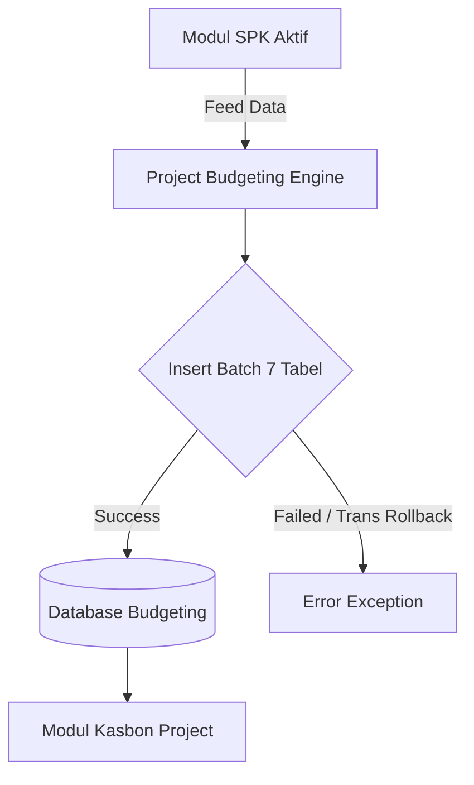

# System Design Document: Modul Project Budgeting

## 1. Context & Goals
**Background Singkat:** 
Tidak adanya batas kendali (Plafon) anggaran operasional memicu pemborosan. *Project Budgeting* hadir untuk mengunci alokasi budget (*Subcont, Lab, Akomodasi, dsb*) dan mensimulasikan taksiran Profit (Gross Margin) sebelum Kasbon bisa dikeluarkan.

**Out of Scope:** 
Tidak mengurusi proses pengeluaran dana ke rekening pribadi / vendor. Modul ini hanya menyusun "Pagar Batas Nilai / Limit Anggaran".

---

## 2. Proposed Architecture
**Architecture Diagram:**


**Component Breakdown:**
- **Project Budgeting Controller:** Pintu masuk (Gateway) yang memecah satu form raksasa (terdiri dari *subcont, accommodation, others*) menjadi 7 objek *array*.
- **Database Transaction Manager:** Mengawasi jalannya *Wipe and Replace* (menghapus data lama jika ada revisi, lalu menulis ulang dengan `insert_batch`).

---

## 3. Data Model & Storage
**Schema Database (ERD Singkat):**
- **`kons_tr_spk_budgeting`** (Header): `id_spk_budgeting` (PK), `id_spk_penawaran`.
- **`kons_tr_spk_budgeting_akomodasi`**: `id_spk_budgeting` (FK), `qty_estimasi`, `total_final`.
- **`kons_tr_spk_budgeting_aktifitas`**: (Sama seperti akomodasi, menyimpan detail *Mandays* final).
*(Total terdapat 6-7 tabel anak dengan struktur serupa)*

**Caching Strategy:**
- Tidak ada *caching*. Kueri dijalankan langsung agar angka yang tampil di sisi operasional selalu *Fresh*.

---

## 4. Interface Definitions (API Contract)
**A. Save/Update Budgeting (AJAX Form Submit)**
- **Endpoint:** `POST /project_budgeting/save_budgeting`
- **Request Payload:** Form *Multipart* dengan *nested arrays*.
  ```json
  {
    "id_spk_penawaran": "SPK-001",
    "akomodasi[0][id_item]": "1",
    "akomodasi[0][qty_final]": "3",
    "akomodasi[0][total_final]": "1500000"
  }
  ```
- **Response Payload:**
  ```json
  {
    "status": 1,
    "pesan": "Budgeting berhasil disimpan (Wipe & Replace method)"
  }
  ```

---

## 5. Non-Functional Requirements & Trade-offs
**Scalability & Performance:**
- Terdapat metode penghapusan *bulk* sebelum penulisan baru (`DELETE FROM child_tables WHERE id_spk_penawaran = ?`). Diperkirakan bisa mencapai ratusan *queries/second* saat 1 form disimpan.
- **Wajib menggunakan Indexed Keys** pada kolom `id_spk_budgeting` di setiap tabel anak agar fungsi DELETE ini tidak me-*lock* seluruh tabel (Table Lock).

**Security:**
- Validasi status di Backend: Jika `sts == 1` (Sudah Approved), maka fungsi `del_spk_budgeting` maupun `save_budgeting` akan mengembalikan kode *Error 403 / Warning*.

**Trade-offs:**
- **Wipe and Replace vs Incremental Update:** Sistem ini memilih menghapus baris lama dan men- *insert* ulang (*Wipe & Replace*) seluruh data detail saat terjadi pengeditan draf.
  *Alasan:* Logikanya sangat mudah dikodekan (mengurangi kerumitan `UPDATE WHERE id = X`).
  *Risiko:* Jika *database transaction* gagal di tengah jalan, data bisa hilang, karenanya implementasi `db->trans_begin()` bersifat **Kritis (Wajib)**.

---

## 6. Infrastructure & Deployment Impact
**Infrastructure Changes:**
- - 

**Migration Plan:**
- DDL 7 Tabel baru. Script migrasi dijalankan, dipastikan *Engine* DB menggunakan `InnoDB` untuk mendukung *Atomic Transactions*.
