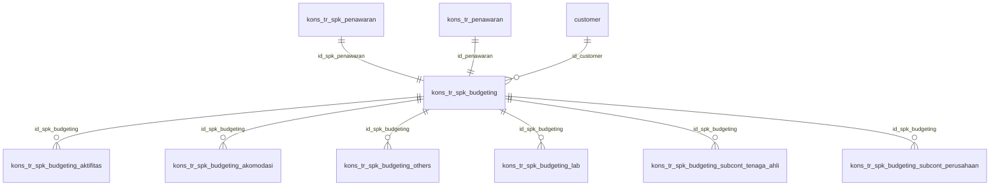

# ERD Database - Modul Project Budgeting

## Informasi Database

| Parameter   | Nilai             |
| ----------- | ----------------- |
| Host        | mysql8 (Docker)   |
| Port        | 3307              |
| Database    | db_consultant_new |
| Driver      | mysqli            |
| User        | root              |
| Total Tabel | 7 tabel           |

## Daftar Tabel

### Tabel Transaksi:

1. `kons_tr_spk_budgeting` - Header Project Budgeting
2. `kons_tr_spk_budgeting_aktifitas` - Detail aktifitas budgeting
3. `kons_tr_spk_budgeting_akomodasi` - Detail akomodasi budgeting
4. `kons_tr_spk_budgeting_others` - Detail biaya lain-lain budgeting
5. `kons_tr_spk_budgeting_lab` - Detail biaya lab budgeting
6. `kons_tr_spk_budgeting_subcont_tenaga_ahli` - Detail subcont tenaga ahli budgeting
7. `kons_tr_spk_budgeting_subcont_perusahaan` - Detail subcont perusahaan budgeting

### Related Tables:

- `kons_tr_spk_penawaran` (FK: id_spk_penawaran)
- `kons_tr_penawaran` (FK: id_penawaran)
- `customer` (FK: id_customer)

---

## ERD Diagram



    kons_tr_spk_penawaran {
        varchar id_spk_penawaran PK
        varchar id_penawaran FK
        varchar id_customer FK
        decimal nilai_kontrak
        varchar sts_spk
        int total_mandays
    }

    kons_tr_penawaran {
        varchar id_quotation PK
        varchar id_customer FK
        decimal grand_total
        varchar sts_quot
        varchar id_spk_penawaran
    }

    customer {
        varchar id_customer PK
        varchar nm_customer
        enum deleted
    }

    kons_tr_spk_budgeting {
        varchar id_spk_budgeting PK
        varchar id_spk_penawaran FK
        varchar id_penawaran FK
        varchar id_customer FK
        decimal nilai_kontrak_bersih
        decimal grand_total
        int sts
    }

    kons_tr_spk_budgeting_aktifitas {
        int id PK
        varchar id_spk_budgeting FK
        varchar id_spk_penawaran FK
        decimal total_aktifitas_estimasi
        decimal total_aktifitas_final
    }

    kons_tr_spk_budgeting_akomodasi {
        int id PK
        varchar id_spk_budgeting FK
        varchar id_spk_penawaran FK
        decimal total_estimasi
        decimal total_final
    }

    kons_tr_spk_budgeting_others {
        int id PK
        varchar id_spk_budgeting FK
        varchar id_spk_penawaran FK
        decimal total_estimasi
        decimal total_final
    }

    kons_tr_spk_budgeting_lab {
        int id PK
        varchar id_spk_budgeting FK
        varchar id_spk_penawaran FK
        decimal total_estimasi
        decimal total_final
    }

    kons_tr_spk_budgeting_subcont_tenaga_ahli {
        int id PK
        varchar id_spk_budgeting FK
        varchar id_spk_penawaran FK
        decimal total_estimasi
        decimal total_final
    }

    kons_tr_spk_budgeting_subcont_perusahaan {
        int id PK
        varchar id_spk_budgeting FK
        varchar id_spk_penawaran FK
        decimal total_estimasi
        decimal total_final
    }

```

---

## Penjelasan Relasi

### A. Project Budgeting (Flow Utama)
```

kons_tr_spk_penawaran (1) ──── (1) kons_tr_spk_budgeting
kons_tr_penawaran (1) ─────────────┘
customer (1) ──────────────────────(N)┘
│
├── (N) kons_tr_spk_budgeting_aktifitas
├── (N) kons_tr_spk_budgeting_akomodasi
├── (N) kons_tr_spk_budgeting_others
├── (N) kons_tr_spk_budgeting_lab
├── (N) kons_tr_spk_budgeting_subcont_tenaga_ahli
└── (N) kons_tr_spk_budgeting_subcont_perusahaan

```

```

---

## Alur Approval Project Budgeting (Single-level)

```
Draft (sts=0) → Approved (sts=1) / Rejected (sts=2)
```

| Status   | Nilai   | Keterangan                                    |
| -------- | ------- | --------------------------------------------- |
| Pending  | sts = 0 | Draft, menunggu approval                      |
| Approved | sts = 1 | Disetujui, approved_by & approved_date terisi |
| Rejected | sts = 2 | Ditolak, reject_reason terisi                 |

---

## Struktur Tabel

### 1. kons_tr_spk_budgeting

**Header Project Budgeting** — Tabel utama menyimpan data budgeting project.

| Field                            | Type          | Null | Key | Default | Keterangan                                 |
| -------------------------------- | ------------- | ---- | --- | ------- | ------------------------------------------ |
| id_spk_budgeting                 | varchar(100)  | NO   | PRI | NULL    | PK, format: SPK-BUDGET/YY/MM/XXX           |
| id_spk_penawaran                 | varchar(100)  | NO   | FK  | NULL    | FK ke kons_tr_spk_penawaran                |
| id_penawaran                     | varchar(100)  | NO   | FK  | NULL    | FK ke kons_tr_penawaran                    |
| id_customer                      | varchar(100)  | YES  | FK  | NULL    | FK ke customer                             |
| nm_customer                      | varchar(255)  | YES  |     | NULL    | Nama customer (denormalized)               |
| alamat                           | text          | YES  |     | NULL    | Alamat                                     |
| no_npwp                          | varchar(100)  | YES  |     | NULL    | NPWP customer                              |
| id_pic                           | varchar(100)  | NO   |     | NULL    | ID PIC                                     |
| nm_pic                           | varchar(255)  | YES  |     | NULL    | Nama PIC                                   |
| jabatan_pic                      | varchar(100)  | NO   |     | NULL    | Jabatan PIC                                |
| kontak_pic                       | varchar(100)  | YES  |     | NULL    | Kontak PIC                                 |
| id_project                       | varchar(100)  | YES  |     | NULL    | ID project                                 |
| nm_project                       | varchar(255)  | YES  |     | NULL    | Nama project                               |
| id_project_leader                | varchar(100)  | YES  |     | NULL    | ID project leader                          |
| nm_project_leader                | text          | YES  |     | NULL    | Nama project leader                        |
| id_konsultan_1                   | varchar(100)  | YES  |     | NULL    | ID konsultan 1                             |
| nm_konsultan_1                   | text          | YES  |     | NULL    | Nama konsultan 1                           |
| id_konsultan_2                   | varchar(100)  | YES  |     | NULL    | ID konsultan 2                             |
| nm_konsultan_2                   | text          | YES  |     | NULL    | Nama konsultan 2                           |
| total_mandays                    | decimal(20,2) | NO   |     | 0.00    | Total mandays                              |
| mandays_internal                 | decimal(20,2) | NO   |     | 0.00    | Mandays internal                           |
| mandays_tandem                   | decimal(20,2) | NO   |     | 0.00    | Mandays tandem                             |
| mandays_subcont                  | decimal(20,2) | NO   |     | 0.00    | Mandays subcont                            |
| biaya_konsultasi                 | decimal(20,2) | NO   |     | 0.00    | Biaya konsultasi                           |
| biaya_tandem                     | decimal(20,2) | NO   |     | 0.00    | Biaya tandem                               |
| biaya_subcont                    | decimal(20,2) | NO   |     | 0.00    | Biaya subcont                              |
| biaya_akomodasi                  | decimal(20,2) | NO   |     | 0.00    | Biaya akomodasi                            |
| biaya_others                     | decimal(20,2) | NO   |     | 0.00    | Biaya lain-lain                            |
| biaya_lab                        | decimal(20,2) | NO   |     | 0.00    | Biaya lab                                  |
| biaya_subcont_tenaga_ahli        | decimal(20,2) | NO   |     | 0.00    | Biaya subcont tenaga ahli                  |
| biaya_subcont_perusahaan         | decimal(20,2) | NO   |     | 0.00    | Biaya subcont perusahaan                   |
| nilai_kontrak_bersih             | decimal(20,2) | NO   |     | 0.00    | Nilai kontrak bersih                       |
| mandays_rate                     | decimal(20,2) | NO   |     | 0.00    | Rate mandays                               |
| ppn                              | int           | YES  |     | NULL    | PPN flag                                   |
| persen_ppn                       | decimal(20,2) | YES  |     | NULL    | Persentase PPN                             |
| nilai_ppn                        | decimal(20,2) | NO   |     | NULL    | Nilai PPN                                  |
| grand_total                      | decimal(20,2) | YES  |     | NULL    | Grand total                                |
| mandays_subcont_before           | int           | YES  |     | NULL    | Mandays subcont (before/penawaran)         |
| biaya_subcont_before             | decimal(20,2) | NO   |     | 0.00    | Biaya subcont (before)                     |
| biaya_akomodasi_before           | decimal(20,2) | NO   |     | 0.00    | Biaya akomodasi (before)                   |
| biaya_others_before              | decimal(20,2) | NO   |     | 0.00    | Biaya others (before)                      |
| biaya_lab_before                 | decimal(20,2) | NO   |     | 0.00    | Biaya lab (before)                         |
| biaya_subcont_tenaga_ahli_before | decimal(20,2) | NO   |     | 0.00    | Biaya subcont TA (before)                  |
| biaya_subcont_perusahaan_before  | decimal(20,2) | NO   |     | 0.00    | Biaya subcont PR (before)                  |
| mandays_subcont_after            | int           | NO   |     | 0       | Mandays subcont (after/budgeting)          |
| biaya_subcont_after              | decimal(20,2) | NO   |     | 0.00    | Biaya subcont (after)                      |
| biaya_akomodasi_after            | decimal(20,2) | NO   |     | 0.00    | Biaya akomodasi (after)                    |
| biaya_others_after               | decimal(20,2) | NO   |     | 0.00    | Biaya others (after)                       |
| biaya_lab_after                  | decimal(20,2) | NO   |     | 0.00    | Biaya lab (after)                          |
| biaya_subcont_tenaga_ahli_after  | decimal(20,2) | NO   |     | 0.00    | Biaya subcont TA (after)                   |
| biaya_subcont_perusahaan_after   | decimal(20,2) | NO   |     | 0.00    | Biaya subcont PR (after)                   |
| mandays_subcont_result           | int           | NO   |     | 0       | Mandays subcont (result/selisih)           |
| biaya_subcont_result             | decimal(20,2) | NO   |     | 0.00    | Biaya subcont (result)                     |
| biaya_akomodasi_result           | decimal(20,2) | NO   |     | 0.00    | Biaya akomodasi (result)                   |
| biaya_others_result              | decimal(20,2) | NO   |     | 0.00    | Biaya others (result)                      |
| biaya_lab_result                 | decimal(20,2) | NO   |     | 0.00    | Biaya lab (result)                         |
| biaya_subcont_tenaga_ahli_result | decimal(20,2) | NO   |     | 0.00    | Biaya subcont TA (result)                  |
| biaya_subcont_perusahaan_result  | decimal(20,2) | NO   |     | 0.00    | Biaya subcont PR (result)                  |
| sts                              | int           | NO   |     | 0       | Status (0=pending, 1=approved, 2=rejected) |
| reject_reason                    | text          | NO   |     | NULL    | Alasan reject                              |
| create_by                        | varchar(100)  | YES  |     | NULL    | User input                                 |
| create_date                      | datetime      | YES  |     | NULL    | Tanggal input                              |
| update_by                        | varchar(100)  | YES  |     | NULL    | User update                                |
| update_date                      | datetime      | YES  |     | NULL    | Tanggal update                             |
| delete_by                        | varchar(100)  | YES  |     | NULL    | User delete                                |
| delete_date                      | datetime      | YES  |     | NULL    | Tanggal delete                             |
| approved_by                      | varchar(100)  | YES  |     | NULL    | User approval                              |
| approved_date                    | datetime      | YES  |     | NULL    | Tanggal approval                           |

---

### 2. kons_tr_spk_budgeting_aktifitas

**Detail Aktifitas Budgeting** — Menyimpan detail aktifitas dengan pola estimasi vs final.

| Field                         | Type          | Null | Key | Default | Keterangan                        |
| ----------------------------- | ------------- | ---- | --- | ------- | --------------------------------- |
| id                            | int           | NO   | PRI | NULL    | Auto increment                    |
| id_spk_budgeting              | varchar(100)  | NO   | FK  | NULL    | FK ke kons_tr_spk_budgeting       |
| id_spk_penawaran              | varchar(100)  | NO   | FK  | NULL    | FK ke kons_tr_spk_penawaran       |
| id_penawaran                  | varchar(100)  | NO   | FK  | NULL    | FK ke kons_tr_penawaran           |
| id_aktifitas                  | varchar(100)  | NO   |     | NULL    | ID master aktifitas               |
| nm_aktifitas                  | text          | YES  |     | NULL    | Nama aktifitas                    |
| mandays_estimasi              | decimal(20,2) | YES  |     | 0.00    | Mandays estimasi (dari penawaran) |
| mandays_rate_estimasi         | decimal(20,2) | YES  |     | 0.00    | Rate mandays estimasi             |
| mandays_tandem_estimasi       | decimal(20,2) | YES  |     | 0.00    | Mandays tandem estimasi           |
| mandays_rate_tandem_estimasi  | decimal(20,2) | YES  |     | 0.00    | Rate tandem estimasi              |
| mandays_subcont_estimasi      | decimal(20,2) | YES  |     | 0.00    | Mandays subcont estimasi          |
| mandays_rate_subcont_estimasi | decimal(20,2) | YES  |     | 0.00    | Rate subcont estimasi             |
| total_aktifitas_estimasi      | decimal(20,2) | YES  |     | 0.00    | Total aktifitas estimasi          |
| mandays_final                 | decimal(20,2) | YES  |     | 0.00    | Mandays final (budgeting)         |
| mandays_rate_final            | decimal(20,2) | YES  |     | 0.00    | Rate mandays final                |
| mandays_tandem_final          | decimal(20,2) | YES  |     | 0.00    | Mandays tandem final              |
| mandays_rate_tandem_final     | decimal(20,2) | YES  |     | 0.00    | Rate tandem final                 |
| mandays_subcont_final         | decimal(20,2) | YES  |     | 0.00    | Mandays subcont final             |
| mandays_rate_subcont_final    | decimal(20,2) | YES  |     | 0.00    | Rate subcont final                |
| total_aktifitas_final         | decimal(20,2) | YES  |     | 0.00    | Total aktifitas final             |
| create_by                     | varchar(100)  | NO   |     | NULL    | User input                        |
| create_date                   | datetime      | NO   |     | NULL    | Tanggal input                     |

---

### 3. kons_tr_spk_budgeting_akomodasi

**Detail Akomodasi Budgeting** — Menyimpan detail biaya akomodasi dengan pola estimasi vs final.

| Field               | Type          | Null | Key | Default | Keterangan                      |
| ------------------- | ------------- | ---- | --- | ------- | ------------------------------- |
| id                  | int           | NO   | PRI | NULL    | Auto increment                  |
| id_spk_budgeting    | varchar(100)  | NO   | FK  | NULL    | FK ke kons_tr_spk_budgeting     |
| id_spk_penawaran    | varchar(100)  | YES  | FK  | NULL    | FK ke kons_tr_spk_penawaran     |
| id_penawaran        | varchar(100)  | NO   | FK  | NULL    | FK ke kons_tr_penawaran         |
| id_akomodasi        | varchar(100)  | NO   |     | NULL    | ID referensi akomodasi original |
| id_item             | varchar(100)  | NO   |     | NULL    | ID item                         |
| nm_item             | text          | NO   |     | NULL    | Nama item                       |
| qty_estimasi        | decimal(20,2) | NO   |     | 0.00    | Qty estimasi (dari penawaran)   |
| price_unit_estimasi | decimal(20,2) | NO   |     | 0.00    | Harga satuan estimasi           |
| total_estimasi      | decimal(20,2) | NO   |     | 0.00    | Total estimasi                  |
| qty_final           | decimal(20,2) | NO   |     | 0.00    | Qty final (budgeting)           |
| price_unit_final    | decimal(20,2) | NO   |     | 0.00    | Harga satuan final              |
| total_final         | decimal(20,2) | NO   |     | NULL    | Total final                     |
| keterangan          | text          | YES  |     | NULL    | Keterangan                      |
| create_by           | varchar(100)  | YES  |     | NULL    | User input                      |
| create_date         | datetime      | YES  |     | NULL    | Tanggal input                   |

---

### 4. kons_tr_spk_budgeting_others

**Detail Biaya Lain-lain Budgeting** — Menyimpan detail biaya others dengan pola estimasi vs final.

| Field               | Type          | Null | Key | Default | Keterangan                   |
| ------------------- | ------------- | ---- | --- | ------- | ---------------------------- |
| id                  | int           | NO   | PRI | NULL    | Auto increment               |
| id_spk_penawaran    | varchar(100)  | YES  | FK  | NULL    | FK ke kons_tr_spk_penawaran  |
| id_spk_budgeting    | varchar(100)  | NO   | FK  | NULL    | FK ke kons_tr_spk_budgeting  |
| id_penawaran        | varchar(100)  | NO   | FK  | NULL    | FK ke kons_tr_penawaran      |
| id_others           | varchar(100)  | NO   |     | NULL    | ID referensi others original |
| id_item             | varchar(100)  | NO   |     | NULL    | ID item                      |
| nm_item             | text          | NO   |     | NULL    | Nama item                    |
| qty_estimasi        | decimal(20,2) | NO   |     | 0.00    | Qty estimasi                 |
| price_unit_estimasi | decimal(20,2) | NO   |     | 0.00    | Harga satuan estimasi        |
| total_estimasi      | decimal(20,2) | NO   |     | 0.00    | Total estimasi               |
| qty_final           | decimal(20,2) | NO   |     | 0.00    | Qty final                    |
| price_unit_final    | decimal(20,2) | NO   |     | 0.00    | Harga satuan final           |
| total_final         | decimal(20,2) | NO   |     | NULL    | Total final                  |
| keterangan          | text          | YES  |     | NULL    | Keterangan                   |
| create_by           | varchar(100)  | YES  |     | NULL    | User input                   |
| create_date         | datetime      | YES  |     | NULL    | Tanggal input                |

---

### 5. kons_tr_spk_budgeting_lab

**Detail Biaya Lab Budgeting** — Menyimpan detail biaya lab dengan pola estimasi vs final.

| Field               | Type          | Null | Key | Default | Keterangan                  |
| ------------------- | ------------- | ---- | --- | ------- | --------------------------- |
| id                  | int           | NO   | PRI | NULL    | Auto increment              |
| id_spk_penawaran    | varchar(100)  | YES  | FK  | NULL    | FK ke kons_tr_spk_penawaran |
| id_spk_budgeting    | varchar(100)  | NO   | FK  | NULL    | FK ke kons_tr_spk_budgeting |
| id_penawaran        | varchar(100)  | NO   | FK  | NULL    | FK ke kons_tr_penawaran     |
| id_lab              | varchar(100)  | NO   |     | NULL    | ID referensi lab original   |
| id_item             | varchar(100)  | NO   |     | NULL    | ID item                     |
| nm_item             | text          | NO   |     | NULL    | Nama item                   |
| qty_estimasi        | decimal(20,2) | NO   |     | 0.00    | Qty estimasi                |
| price_unit_estimasi | decimal(20,2) | NO   |     | 0.00    | Harga satuan estimasi       |
| total_estimasi      | decimal(20,2) | NO   |     | 0.00    | Total estimasi              |
| qty_final           | decimal(20,2) | NO   |     | 0.00    | Qty final                   |
| price_unit_final    | decimal(20,2) | NO   |     | 0.00    | Harga satuan final          |
| total_final         | decimal(20,2) | NO   |     | NULL    | Total final                 |
| keterangan          | text          | YES  |     | NULL    | Keterangan                  |
| create_by           | varchar(100)  | YES  |     | NULL    | User input                  |
| create_date         | datetime      | YES  |     | NULL    | Tanggal input               |

---

### 6. kons_tr_spk_budgeting_subcont_tenaga_ahli

**Detail Subcont Tenaga Ahli Budgeting** — Menyimpan detail biaya subcont tenaga ahli dengan pola estimasi vs final.

| Field               | Type          | Null | Key | Default | Keterangan                    |
| ------------------- | ------------- | ---- | --- | ------- | ----------------------------- |
| id                  | int           | NO   | PRI | NULL    | Auto increment                |
| id_spk_penawaran    | varchar(100)  | YES  | FK  | NULL    | FK ke kons_tr_spk_penawaran   |
| id_spk_budgeting    | varchar(100)  | NO   | FK  | NULL    | FK ke kons_tr_spk_budgeting   |
| id_penawaran        | varchar(100)  | NO   | FK  | NULL    | FK ke kons_tr_penawaran       |
| id_subcont          | varchar(100)  | NO   |     | NULL    | ID referensi subcont original |
| id_item             | varchar(100)  | NO   |     | NULL    | ID item                       |
| nm_item             | text          | NO   |     | NULL    | Nama item                     |
| qty_estimasi        | decimal(20,2) | NO   |     | 0.00    | Qty estimasi                  |
| price_unit_estimasi | decimal(20,2) | NO   |     | 0.00    | Harga satuan estimasi         |
| total_estimasi      | decimal(20,2) | NO   |     | 0.00    | Total estimasi                |
| qty_final           | decimal(20,2) | NO   |     | 0.00    | Qty final                     |
| price_unit_final    | decimal(20,2) | NO   |     | 0.00    | Harga satuan final            |
| total_final         | decimal(20,2) | NO   |     | NULL    | Total final                   |
| keterangan          | text          | YES  |     | NULL    | Keterangan                    |
| create_by           | varchar(100)  | YES  |     | NULL    | User input                    |
| create_date         | datetime      | YES  |     | NULL    | Tanggal input                 |

---

### 7. kons_tr_spk_budgeting_subcont_perusahaan

**Detail Subcont Perusahaan Budgeting** — Menyimpan detail biaya subcont perusahaan dengan pola estimasi vs final.

| Field               | Type          | Null | Key | Default | Keterangan                    |
| ------------------- | ------------- | ---- | --- | ------- | ----------------------------- |
| id                  | int           | NO   | PRI | NULL    | Auto increment                |
| id_spk_penawaran    | varchar(100)  | YES  | FK  | NULL    | FK ke kons_tr_spk_penawaran   |
| id_spk_budgeting    | varchar(100)  | NO   | FK  | NULL    | FK ke kons_tr_spk_budgeting   |
| id_penawaran        | varchar(100)  | NO   | FK  | NULL    | FK ke kons_tr_penawaran       |
| id_subcont          | varchar(100)  | NO   |     | NULL    | ID referensi subcont original |
| id_item             | varchar(100)  | NO   |     | NULL    | ID item                       |
| nm_item             | text          | NO   |     | NULL    | Nama item                     |
| qty_estimasi        | decimal(20,2) | NO   |     | 0.00    | Qty estimasi                  |
| price_unit_estimasi | decimal(20,2) | NO   |     | 0.00    | Harga satuan estimasi         |
| total_estimasi      | decimal(20,2) | NO   |     | 0.00    | Total estimasi                |
| qty_final           | decimal(20,2) | NO   |     | 0.00    | Qty final                     |
| price_unit_final    | decimal(20,2) | NO   |     | 0.00    | Harga satuan final            |
| total_final         | decimal(20,2) | NO   |     | NULL    | Total final                   |
| keterangan          | text          | YES  |     | NULL    | Keterangan                    |
| create_by           | varchar(100)  | YES  |     | NULL    | User input                    |
| create_date         | datetime      | YES  |     | NULL    | Tanggal input                 |

---

## Related Tables

### kons_tr_spk_penawaran (Ringkasan)

| Field            | Type          | Key | Keterangan              |
| ---------------- | ------------- | --- | ----------------------- |
| id_spk_penawaran | varchar(100)  | PRI | Primary key             |
| id_penawaran     | varchar(100)  | FK  | FK ke kons_tr_penawaran |
| id_customer      | varchar(100)  | FK  | FK ke customer          |
| nilai_kontrak    | decimal(20,2) |     | Nilai kontrak           |
| sts_spk          | varchar(5)    |     | Status SPK              |

### kons_tr_penawaran (Ringkasan)

| Field        | Type          | Key | Keterangan            |
| ------------ | ------------- | --- | --------------------- |
| id_quotation | varchar(100)  | PRI | Primary key           |
| id_customer  | varchar(100)  | FK  | FK ke customer        |
| grand_total  | decimal(20,2) |     | Grand total penawaran |
| sts_quot     | varchar(10)   |     | Status quotation      |

### customer (Ringkasan)

| Field       | Type         | Key | Keterangan       |
| ----------- | ------------ | --- | ---------------- |
| id_customer | varchar(100) | PRI | Primary key      |
| nm_customer | varchar(255) |     | Nama customer    |
| alamat      | varchar(255) |     | Alamat           |
| npwp        | varchar(25)  |     | NPWP             |
| deleted     | enum(Y,N)    |     | Soft delete flag |

---

## Catatan Teknis

> ⚠️ **Penting untuk Developer**

1. **Format ID SPK Budgeting** — `SPK-BUDGET/YY/MM/XXX` (contoh: SPK-BUDGET/24/07/001)
2. **Estimasi vs Final Pattern** — Detail tables memiliki dual columns: `_estimasi` (dari penawaran/SPK original) dan `_final` (actual budgeting values). Memungkinkan perbandingan antara estimasi awal dan budget akhir.
3. **Before/After/Result Pattern** — Header table memiliki triple columns: `_before` (original dari SPK), `_after` (final budget), dan `_result` (selisih/difference).
4. **Denormalisasi** — Field nama (nm_customer, nm_project_leader, dll) disimpan langsung di tabel transaksi untuk menghindari JOIN berlebihan.
5. **Soft Delete** — Pola `delete_by` + `delete_date`. NULL = aktif, terisi = dihapus.
6. **Dual Database** — Data employee dari database `hr_sentral` (koneksi `dbhr`), bukan dari `db_consultant_new`.
7. **Related to SPK Penawaran & Penawaran** — Budgeting terhubung ke kedua tabel induk melalui `id_spk_penawaran` dan `id_penawaran`.
8. **No History Tables** — Modul budgeting lebih sederhana dari SPK penawaran, tidak memiliki tabel history terpisah.
9. **Single-level Approval** — Hanya 1 level approval (langsung approve/reject), berbeda dengan SPK penawaran yang 6 level.
