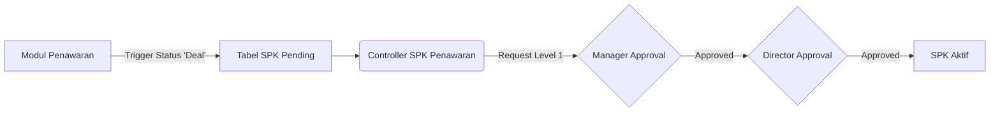

# System Design Document: Modul SPK Penawaran

## 1. Context & Goals
**Background Singkat:** 
Sebelumnya, setelah penawaran disetujui klien, tidak ada *handover* (serah terima) yang rapi ke divisi operasional. Proyek baru dimulai berdasarkan "instruksi lisan". 
Modul SPK (Surat Perintah Kerja) Penawaran mengonversi Quotation yang *Approved/Deal* menjadi mandat resmi bersistem *dual-approval*.

**Out of Scope:** 
Sistem ini tidak menangani penguncian *budget* atau alokasi *mandays* secara matematis (tugas tersebut dilimpahkan ke Modul *Project Budgeting*). Ini hanya sebagai pengesahan dokumen SPK.

---

## 2. Proposed Architecture
**Architecture Diagram:**


**Component Breakdown:**
- **SPK Controller:** Menghandle perpindahan *state* dokumen dari Penawaran -> Draft SPK -> SPK Level 1 -> SPK Final.
- **Workflow / Approval Engine:** Logika fungsi `approve_spk()` yang memeriksa otoritas (*Role ID*) pengguna sebelum menyimpan cap waktu (*timestamp*) *approval*.

---

## 3. Data Model & Storage
**Schema Database (ERD Singkat):**
- **`kons_tr_spk_penawaran`:** 
  - `id_spk_penawaran` (PK)
  - `id_quotation` (FK ke Penawaran)
  - `approval_level1_by`, `approval_level1_date`
  - `approval_level2_by`, `approval_level2_date`
  - `waktu_from`, `waktu_to` (Target waktu pelaksanaan)

**Caching Strategy:**
- Tidak menggunakan Redis. Validasi *Approval* bergantung sepenuhnya pada pembacaan mutakhir `MySQL` (Real-Time ACID Properties) agar terhindar dari *Race Condition* saat persetujuan dilakukan bersamaan.

---

## 4. Interface Definitions (API Contract)
**A. Approval SPK**
- **Endpoint:** `POST /spk_penawaran/approve`
- **Request Payload:**
  ```json
  {
    "id_spk": "SPK-2607-001",
    "level": "1", 
    "notes": "Lanjutkan ke tim konsultan"
  }
  ```
- **Response Payload:**
  ```json
  {
    "status": 1,
    "pesan": "SPK berhasil disetujui (Level 1)."
  }
  ```

---

## 5. Non-Functional Requirements & Trade-offs
**Scalability & Performance:**
- Tampilan list di halaman *Dashboard* bisa memberatkan DB karena harus mencari data yang `status = deal` dan belum memiliki SPK. Oleh karena itu, diperlukan *indexing* pada kolom `id_quotation` dan `status` di tabel Penawaran.

**Security:**
- Validasi Otorisasi di tingkat *Controller* (Hardcoded RBAC). Jika *user id* tidak memiliki akses `approve_level1`, server akan mereturn `403 Forbidden` walaupun AJAX di-*bypass*.

**Trade-offs:**
- Menyimpan *Approval Log* langsung di dalam kolom tabel utama (`approval_level1_by`) daripada tabel *history log* terpisah.
  *Kelebihan:* Kueri pencarian jauh lebih cepat tanpa `JOIN`.
  *Kekurangan:* Tidak bisa menampung siklus bolak-balik (Rejeksi -> Approve berulang) dengan rapi, namun sistem memang dirancang cukup lurus.

---

## 6. Infrastructure & Deployment Impact
**Infrastructure Changes:**
- Tidak butuh *server* baru.

**Migration Plan:**
- Hanya `CREATE TABLE` tabel `kons_tr_spk_penawaran` dan `ALTER TABLE` menambahkan kolom flag `is_spk_created` di tabel Quotation agar tidak terjadi pembuatan SPK ganda.
