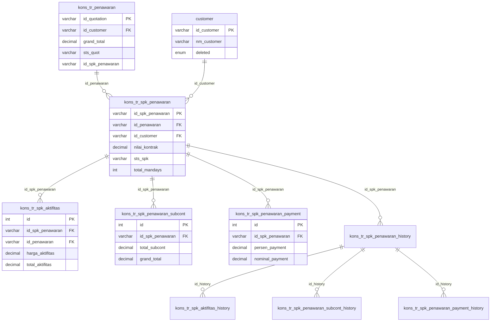

# ERD Database - Modul SPK Penawaran

## Informasi Database

| Parameter   | Nilai             |
| ----------- | ----------------- |
| Host        | mysql8 (Docker)   |
| Port        | 3307              |
| Database    | db_consultant_new |
| Driver      | mysqli            |
| User        | root              |
| Total Tabel | 8 tabel           |

## Daftar Tabel

### Tabel Transaksi:

1. `kons_tr_spk_penawaran` - Header SPK Penawaran
2. `kons_tr_spk_aktifitas` - Detail aktifitas SPK
3. `kons_tr_spk_penawaran_subcont` - Detail subcont SPK
4. `kons_tr_spk_penawaran_payment` - Detail payment terms SPK

### Tabel History:

5. `kons_tr_spk_penawaran_history` - History header SPK
6. `kons_tr_spk_aktifitas_history` - History aktifitas SPK
7. `kons_tr_spk_penawaran_subcont_history` - History subcont SPK
8. `kons_tr_spk_penawaran_payment_history` - History payment SPK

### Related Tables (dari modul penawaran):

- `kons_tr_penawaran` (FK: id_penawaran)
- `customer` (FK: id_customer)

---

## ERD Diagram



    kons_tr_spk_penawaran_history {
        varchar id_history PK
        varchar id_spk_penawaran FK
        varchar id_penawaran FK
        int revisi
    }

    kons_tr_spk_aktifitas_history {
        int id PK
        varchar id_history FK
        varchar id_spk_penawaran FK
    }

    kons_tr_spk_penawaran_subcont_history {
        int id PK
        varchar id_history FK
        varchar id_spk_penawaran FK
    }

    kons_tr_spk_penawaran_payment_history {
        int id PK
        varchar id_history FK
        varchar id_spk_penawaran FK
    }

```

---

## Penjelasan Relasi

### A. SPK Penawaran (Flow Utama)
```

kons_tr_penawaran (1) ──── (N) kons_tr_spk_penawaran
customer (1) ─────────────────┘
│
├── (N) kons_tr_spk_aktifitas
├── (N) kons_tr_spk_penawaran_subcont
├── (N) kons_tr_spk_penawaran_payment
│
└── (N) kons_tr_spk_penawaran_history
│
├── (N) kons_tr_spk_aktifitas_history
├── (N) kons_tr_spk_penawaran_subcont_history
└── (N) kons_tr_spk_penawaran_payment_history

```

---

## Alur Approval SPK Penawaran (Multi-level)

```

Sales → Konsultan 1* → Konsultan 2* → Project Leader → Manager Sales → Direktur

```
*) Opsional, tergantung apakah id_konsultan_1 / id_konsultan_2 terisi.

| Level | Field Status | Field Reject |
|-------|-------------|--------------|
| 1. Sales | approval_sales_sts | reject_sales_sts |
| 2. Konsultan 1 | approval_konsultan_1_sts | reject_konsultan_1_sts |
| 3. Konsultan 2 | approval_konsultan_2_sts | reject_konsultan_2_sts |
| 4. Project Leader | approval_project_leader_sts | reject_project_leader_sts |
| 5. Manager Sales | approval_manager_sales | reject_manager_sales_sts |
| 6. Direktur | approval_level2_sts | reject_level2_by |

**Final Status:** `sts_spk = '1'` (Approved) atau `sts_spk = '0'` (Rejected)

---
```

## Struktur Tabel

### 1. kons_tr_spk_penawaran

**Header SPK Penawaran** — Tabel utama menyimpan data Surat Perintah Kerja.

| Field                              | Type          | Null | Key | Default | Keterangan                          |
| ---------------------------------- | ------------- | ---- | --- | ------- | ----------------------------------- |
| id_spk_penawaran                   | varchar(100)  | NO   | PRI | NULL    | Primary key                         |
| id_penawaran                       | varchar(100)  | YES  | FK  | NULL    | FK ke kons_tr_penawaran             |
| id_customer                        | varchar(100)  | YES  | FK  | NULL    | FK ke customer                      |
| nm_customer                        | text          | YES  |     | NULL    | Nama customer (denormalized)        |
| address                            | text          | YES  |     | NULL    | Alamat                              |
| npwp_cust                          | varchar(100)  | NO   |     | NULL    | NPWP customer                       |
| nm_pic                             | text          | YES  |     | NULL    | Nama PIC                            |
| tipe_informasi_awal                | varchar(100)  | YES  |     | NULL    | Tipe informasi awal                 |
| detail_informasi_awal              | varchar(100)  | YES  |     | NULL    | Detail informasi awal               |
| tipe_info_awal_eks                 | varchar(5)    | YES  |     | NULL    | Tipe info awal eksternal            |
| detail_info_awal_eks               | text          | YES  |     | NULL    | Detail info awal eksternal          |
| cp_info_awal_eks                   | varchar(200)  | YES  |     | NULL    | Contact person info awal eks        |
| waktu_from                         | date          | YES  |     | NULL    | Tanggal mulai project               |
| waktu_to                           | date          | YES  |     | NULL    | Tanggal selesai project             |
| id_sales                           | varchar(100)  | YES  |     | NULL    | ID sales                            |
| nm_sales                           | text          | YES  |     | NULL    | Nama sales                          |
| upload_proposal                    | text          | YES  |     | NULL    | Path file proposal                  |
| id_project                         | varchar(100)  | YES  |     | NULL    | ID project                          |
| nm_project                         | text          | YES  |     | NULL    | Nama project                        |
| id_divisi                          | varchar(100)  | YES  |     | NULL    | ID divisi                           |
| nm_divisi                          | text          | YES  |     | NULL    | Nama divisi                         |
| id_project_leader                  | varchar(100)  | YES  |     | NULL    | ID project leader                   |
| nm_project_leader                  | text          | YES  |     | NULL    | Nama project leader                 |
| id_konsultan_1                     | varchar(100)  | YES  |     | NULL    | ID konsultan 1                      |
| nm_konsultan_1                     | text          | YES  |     | NULL    | Nama konsultan 1                    |
| id_konsultan_2                     | varchar(100)  | YES  |     | NULL    | ID konsultan 2                      |
| nm_konsultan_2                     | text          | YES  |     | NULL    | Nama konsultan 2                    |
| nilai_kontrak                      | decimal(20,2) | NO   |     | 0.00    | Nilai kontrak                       |
| biaya_subcont                      | decimal(20,2) | NO   |     | 0.00    | Biaya subcont                       |
| biaya_akomodasi                    | decimal(20,2) | NO   |     | NULL    | Biaya akomodasi                     |
| biaya_others                       | decimal(20,2) | NO   |     | NULL    | Biaya lain-lain                     |
| biaya_tandem                       | decimal(20,2) | NO   |     | NULL    | Biaya tandem                        |
| biaya_lab                          | decimal(20,2) | NO   |     | 0.00    | Biaya lab                           |
| biaya_subcont_tenaga_ahli          | decimal(20,2) | NO   |     | NULL    | Biaya subcont tenaga ahli           |
| biaya_subcont_perusahaan           | decimal(20,2) | NO   |     | 0.00    | Biaya subcont perusahaan            |
| nilai_kontrak_bersih               | decimal(20,2) | NO   |     | 0.00    | Nilai kontrak bersih                |
| mandays_rate                       | decimal(20,2) | NO   |     | 0.00    | Rate mandays                        |
| total_mandays                      | int           | NO   |     | 0       | Total mandays                       |
| mandays_subcont                    | int           | NO   |     | 0       | Mandays subcont                     |
| mandays_internal                   | int           | NO   |     | 0       | Mandays internal                    |
| nm_pemberi_informasi_1_komisi      | varchar(255)  | NO   |     | NULL    | Nama pemberi info 1 (komisi)        |
| persen_pemberi_informasi_1_komisi  | decimal(20,2) | NO   |     | NULL    | Persen komisi info 1                |
| nominal_pemberi_informasi_1_komisi | decimal(20,2) | NO   |     | NULL    | Nominal komisi info 1               |
| nm_pemberi_informasi_2_komisi      | varchar(255)  | NO   |     | NULL    | Nama pemberi info 2 (komisi)        |
| persen_pemberi_informasi_2_komisi  | decimal(20,2) | NO   |     | NULL    | Persen komisi info 2                |
| nominal_pemberi_informasi_2_komisi | decimal(20,2) | NO   |     | NULL    | Nominal komisi info 2               |
| nm_sales_1_komisi                  | varchar(255)  | NO   |     | NULL    | Nama sales 1 (komisi)               |
| persen_sales_1_komisi              | decimal(20,2) | NO   |     | NULL    | Persen komisi sales 1               |
| nominal_sales_1_komisi             | decimal(20,2) | NO   |     | NULL    | Nominal komisi sales 1              |
| nm_sales_2_komisi                  | varchar(255)  | NO   |     | NULL    | Nama sales 2 (komisi)               |
| persen_sales_2_komisi              | decimal(20,2) | NO   |     | NULL    | Persen komisi sales 2               |
| nominal_sales_2_komisi             | decimal(20,2) | NO   |     | NULL    | Nominal komisi sales 2              |
| isu_khusus                         | text          | NO   |     | NULL    | Isu khusus                          |
| sts_spk                            | varchar(5)    | YES  |     | NULL    | Status SPK (1=approved, 0=rejected) |
| reject_reason                      | text          | YES  |     | NULL    | Alasan reject                       |
| approval_sales_sts                 | varchar(5)    | YES  |     | NULL    | Status approval sales               |
| approval_sales_date                | datetime      | YES  |     | NULL    | Tanggal approval sales              |
| approval_project_leader_sts        | varchar(5)    | YES  |     | NULL    | Status approval project leader      |
| approval_project_leader_date       | datetime      | YES  |     | NULL    | Tanggal approval PL                 |
| approval_konsultan_1_sts           | varchar(5)    | YES  |     | NULL    | Status approval konsultan 1         |
| approval_konsultan_1_date          | datetime      | YES  |     | NULL    | Tanggal approval konsultan 1        |
| approval_konsultan_2_sts           | varchar(5)    | YES  |     | NULL    | Status approval konsultan 2         |
| approval_konsultan_2_date          | datetime      | YES  |     | NULL    | Tanggal approval konsultan 2        |
| reject_project_leader_sts          | varchar(5)    | YES  |     | NULL    | Status reject PL                    |
| reject_project_leader_date         | datetime      | YES  |     | NULL    | Tanggal reject PL                   |
| reject_project_leader_reason       | text          | YES  |     | NULL    | Alasan reject PL                    |
| reject_konsultan_1_sts             | varchar(5)    | YES  |     | NULL    | Status reject konsultan 1           |
| reject_konsultan_1_date            | datetime      | YES  |     | NULL    | Tanggal reject konsultan 1          |
| reject_konsultan_1_reason          | text          | YES  |     | NULL    | Alasan reject konsultan 1           |
| reject_konsultan_2_sts             | varchar(5)    | YES  |     | NULL    | Status reject konsultan 2           |
| reject_konsultan_2_date            | datetime      | YES  |     | NULL    | Tanggal reject konsultan 2          |
| reject_konsultan_2_reason          | text          | YES  |     | NULL    | Alasan reject konsultan 2           |
| reject_sales_sts                   | varchar(5)    | YES  |     | NULL    | Status reject sales                 |
| reject_sales_date                  | datetime      | YES  |     | NULL    | Tanggal reject sales                |
| reject_sales_reason                | text          | YES  |     | NULL    | Alasan reject sales                 |
| approval_level2_sts                | varchar(5)    | YES  |     | NULL    | Status approval direktur            |
| approval_level2_by                 | varchar(45)   | YES  |     | NULL    | User approval direktur              |
| approval_level2_date               | datetime      | YES  |     | NULL    | Tanggal approval direktur           |
| reject_level2_by                   | varchar(45)   | YES  |     | NULL    | User reject direktur                |
| reject_level2_date                 | datetime      | YES  |     | NULL    | Tanggal reject direktur             |
| reject_level2_reason               | text          | YES  |     | NULL    | Alasan reject direktur              |
| approval_manager_sales             | varchar(5)    | YES  |     | NULL    | Status approval manager sales       |
| approval_manager_sales_date        | datetime      | YES  |     | NULL    | Tanggal approval mgr sales          |
| reject_manager_sales_sts           | varchar(5)    | YES  |     | NULL    | Status reject manager sales         |
| reject_manager_sales_date          | datetime      | YES  |     | NULL    | Tanggal reject mgr sales            |
| reject_manager_sales_reason        | text          | YES  |     | NULL    | Alasan reject mgr sales             |
| input_by                           | varchar(100)  | YES  |     | NULL    | User input                          |
| input_date                         | datetime      | YES  |     | NULL    | Tanggal input                       |
| edited_by                          | varchar(100)  | YES  |     | NULL    | User edit                           |
| edited_date                        | datetime      | YES  |     | NULL    | Tanggal edit                        |
| deleted_by                         | varchar(100)  | YES  |     | NULL    | User delete                         |
| deleted_date                       | datetime      | YES  |     | NULL    | Tanggal delete                      |
| id_company                         | varchar(100)  | YES  |     | NULL    | ID company                          |
| nm_company                         | text          | YES  |     | NULL    | Nama company                        |

---

### 2. kons_tr_spk_aktifitas

**Detail aktifitas SPK** — Menyimpan detail aktifitas yang dikerjakan dalam SPK.

| Field               | Type          | Null | Key | Default | Keterangan                  |
| ------------------- | ------------- | ---- | --- | ------- | --------------------------- |
| id                  | int           | NO   | PRI | NULL    | Auto increment              |
| id_penawaran        | varchar(100)  | YES  | FK  | NULL    | FK ke kons_tr_penawaran     |
| id_spk_penawaran    | varchar(50)   | NO   | FK  | NULL    | FK ke kons_tr_spk_penawaran |
| id_aktifitas        | varchar(100)  | YES  |     | NULL    | ID master aktifitas         |
| nm_aktifitas        | text          | YES  |     | NULL    | Nama aktifitas              |
| bobot               | decimal(20,2) | YES  |     | 0.00    | Bobot (%)                   |
| mandays             | decimal(20,2) | NO   |     | 0.00    | Jumlah mandays              |
| mandays_rate        | decimal(20,2) | NO   |     | 0.00    | Rate mandays                |
| mandays_tandem      | decimal(20,2) | NO   |     | NULL    | Mandays tandem              |
| mandays_rate_tandem | decimal(20,2) | NO   |     | NULL    | Rate tandem                 |
| harga_aktifitas     | decimal(20,2) | NO   |     | 0.00    | Harga aktifitas             |
| total_aktifitas     | decimal(20,2) | YES  |     | NULL    | Total aktifitas             |
| input_by            | varchar(100)  | YES  |     | NULL    | User input                  |
| input_date          | datetime      | YES  |     | NULL    | Tanggal input               |

---

### 3. kons_tr_spk_penawaran_subcont

**Detail subcont SPK** — Menyimpan data subkontraktor dalam SPK.

| Field               | Type          | Null | Key | Default | Keterangan                  |
| ------------------- | ------------- | ---- | --- | ------- | --------------------------- |
| id                  | int           | NO   | PRI | NULL    | Auto increment              |
| id_spk_penawaran    | varchar(100)  | YES  | FK  | NULL    | FK ke kons_tr_spk_penawaran |
| id_aktifitas        | varchar(100)  | YES  |     | NULL    | ID aktifitas                |
| nm_aktifitas        | varchar(100)  | YES  |     | NULL    | Nama aktifitas              |
| mandays             | decimal(20,2) | YES  |     | NULL    | Mandays                     |
| mandays_rate        | decimal(20,2) | NO   |     | NULL    | Rate mandays                |
| mandays_tandem      | decimal(20,2) | NO   |     | 0.00    | Mandays tandem              |
| mandays_rate_tandem | decimal(20,2) | NO   |     | 0.00    | Rate tandem                 |
| mandays_subcont     | decimal(20,2) | YES  |     | NULL    | Mandays subcont             |
| price_subcont       | decimal(20,2) | YES  |     | NULL    | Harga subcont               |
| total_subcont       | decimal(20,2) | YES  |     | NULL    | Total subcont               |
| grand_total         | decimal(20,2) | YES  |     | NULL    | Grand total                 |
| keterangan          | text          | YES  |     | NULL    | Keterangan                  |
| dibuat_oleh         | varchar(100)  | YES  |     | NULL    | User input                  |
| dibuat_tgl          | datetime      | YES  |     | NULL    | Tanggal input               |

---

### 4. kons_tr_spk_penawaran_payment

**Detail payment terms SPK** — Menyimpan termin pembayaran SPK.

| Field            | Type          | Null | Key | Default | Keterangan                  |
| ---------------- | ------------- | ---- | --- | ------- | --------------------------- |
| id               | int           | NO   | PRI | NULL    | Auto increment              |
| id_spk_penawaran | varchar(100)  | YES  | FK  | NULL    | FK ke kons_tr_spk_penawaran |
| term_payment     | text          | YES  |     | NULL    | Termin pembayaran           |
| persen_payment   | decimal(20,2) | YES  |     | NULL    | Persentase payment          |
| nominal_payment  | decimal(20,2) | YES  |     | NULL    | Nominal payment             |
| desc_payment     | text          | YES  |     | NULL    | Deskripsi payment           |
| dibuat_oleh      | varchar(100)  | YES  |     | NULL    | User input                  |
| dibuat_tgl       | datetime      | YES  |     | NULL    | Tanggal input               |

---

### 5. kons_tr_spk_penawaran_history

**History header SPK** — Snapshot data header SPK setiap revisi.

| Field                              | Type          | Null | Key | Default | Keterangan                   |
| ---------------------------------- | ------------- | ---- | --- | ------- | ---------------------------- |
| id_history                         | varchar(50)   | NO   | PRI | NULL    | Primary key history          |
| id_spk_penawaran                   | varchar(50)   | NO   | MUL | NULL    | FK ke kons_tr_spk_penawaran  |
| id_penawaran                       | varchar(50)   | YES  | MUL | NULL    | FK ke kons_tr_penawaran      |
| id_customer                        | varchar(50)   | YES  |     | NULL    | ID customer                  |
| nm_customer                        | varchar(255)  | YES  |     | NULL    | Nama customer                |
| address                            | text          | YES  |     | NULL    | Alamat                       |
| npwp_cust                          | varchar(50)   | YES  |     | NULL    | NPWP customer                |
| nm_pic                             | varchar(100)  | YES  |     | NULL    | Nama PIC                     |
| tipe_informasi_awal                | varchar(50)   | YES  |     | NULL    | Tipe informasi awal          |
| detail_informasi_awal              | text          | YES  |     | NULL    | Detail informasi awal        |
| waktu_from                         | date          | YES  |     | NULL    | Tanggal mulai project        |
| waktu_to                           | date          | YES  |     | NULL    | Tanggal selesai project      |
| id_sales                           | varchar(50)   | YES  |     | NULL    | ID sales                     |
| nm_sales                           | varchar(100)  | YES  |     | NULL    | Nama sales                   |
| upload_proposal                    | varchar(255)  | YES  |     | NULL    | Path file proposal           |
| id_project                         | varchar(50)   | YES  |     | NULL    | ID project                   |
| nm_project                         | varchar(255)  | YES  |     | NULL    | Nama project                 |
| id_divisi                          | varchar(50)   | YES  |     | NULL    | ID divisi                    |
| nm_divisi                          | varchar(100)  | YES  |     | NULL    | Nama divisi                  |
| id_project_leader                  | varchar(50)   | YES  |     | NULL    | ID project leader            |
| nm_project_leader                  | varchar(100)  | YES  |     | NULL    | Nama project leader          |
| id_konsultan_1                     | varchar(50)   | YES  |     | NULL    | ID konsultan 1               |
| nm_konsultan_1                     | varchar(100)  | YES  |     | NULL    | Nama konsultan 1             |
| id_konsultan_2                     | varchar(50)   | YES  |     | NULL    | ID konsultan 2               |
| nm_konsultan_2                     | varchar(100)  | YES  |     | NULL    | Nama konsultan 2             |
| nilai_kontrak                      | decimal(20,2) | YES  |     | 0.00    | Nilai kontrak                |
| biaya_subcont                      | decimal(20,2) | YES  |     | 0.00    | Biaya subcont                |
| biaya_akomodasi                    | decimal(20,2) | YES  |     | 0.00    | Biaya akomodasi              |
| biaya_others                       | decimal(20,2) | YES  |     | 0.00    | Biaya lain-lain              |
| biaya_tandem                       | decimal(20,2) | YES  |     | 0.00    | Biaya tandem                 |
| biaya_lab                          | decimal(20,2) | YES  |     | 0.00    | Biaya lab                    |
| biaya_subcont_tenaga_ahli          | decimal(20,2) | YES  |     | 0.00    | Biaya subcont tenaga ahli    |
| biaya_subcont_perusahaan           | decimal(20,2) | YES  |     | 0.00    | Biaya subcont perusahaan     |
| nilai_kontrak_bersih               | decimal(20,2) | YES  |     | 0.00    | Nilai kontrak bersih         |
| mandays_rate                       | decimal(20,2) | YES  |     | 0.00    | Rate mandays                 |
| total_mandays                      | decimal(20,2) | YES  |     | 0.00    | Total mandays                |
| mandays_subcont                    | decimal(20,2) | YES  |     | 0.00    | Mandays subcont              |
| mandays_internal                   | decimal(20,2) | YES  |     | 0.00    | Mandays internal             |
| nm_pemberi_informasi_1_komisi      | varchar(100)  | YES  |     | NULL    | Nama pemberi info 1          |
| persen_pemberi_informasi_1_komisi  | decimal(5,2)  | YES  |     | 0.00    | Persen komisi info 1         |
| nominal_pemberi_informasi_1_komisi | decimal(20,2) | YES  |     | 0.00    | Nominal komisi info 1        |
| nm_pemberi_informasi_2_komisi      | varchar(100)  | YES  |     | NULL    | Nama pemberi info 2          |
| persen_pemberi_informasi_2_komisi  | decimal(5,2)  | YES  |     | 0.00    | Persen komisi info 2         |
| nominal_pemberi_informasi_2_komisi | decimal(20,2) | YES  |     | 0.00    | Nominal komisi info 2        |
| nm_sales_1_komisi                  | varchar(100)  | YES  |     | NULL    | Nama sales 1                 |
| persen_sales_1_komisi              | decimal(5,2)  | YES  |     | 0.00    | Persen komisi sales 1        |
| nominal_sales_1_komisi             | decimal(20,2) | YES  |     | 0.00    | Nominal komisi sales 1       |
| nm_sales_2_komisi                  | varchar(100)  | YES  |     | NULL    | Nama sales 2                 |
| persen_sales_2_komisi              | decimal(5,2)  | YES  |     | 0.00    | Persen komisi sales 2        |
| nominal_sales_2_komisi             | decimal(20,2) | YES  |     | 0.00    | Nominal komisi sales 2       |
| isu_khusus                         | text          | YES  |     | NULL    | Isu khusus                   |
| tipe_info_awal_eks                 | varchar(50)   | YES  |     | NULL    | Tipe info awal eksternal     |
| detail_info_awal_eks               | text          | YES  |     | NULL    | Detail info awal eks         |
| cp_info_awal_eks                   | varchar(100)  | YES  |     | NULL    | CP info awal eks             |
| sts_spk                            | varchar(1)    | YES  |     | NULL    | Status SPK                   |
| approval_sales_sts                 | varchar(50)   | YES  |     | NULL    | Status approval sales        |
| approval_sales_date                | datetime      | YES  |     | NULL    | Tanggal approval sales       |
| approval_konsultan_1_sts           | varchar(50)   | YES  |     | NULL    | Status approval konsultan 1  |
| approval_konsultan_1_date          | datetime      | YES  |     | NULL    | Tanggal approval konsultan 1 |
| approval_konsultan_2_sts           | varchar(50)   | YES  |     | NULL    | Status approval konsultan 2  |
| approval_konsultan_2_date          | datetime      | YES  |     | NULL    | Tanggal approval konsultan 2 |
| approval_level2_sts                | varchar(50)   | YES  |     | NULL    | Status approval direktur     |
| approval_level2_date               | datetime      | YES  |     | NULL    | Tanggal approval direktur    |
| approval_manager_sales             | varchar(50)   | YES  |     | NULL    | Status approval mgr sales    |
| approval_manager_sales_date        | datetime      | YES  |     | NULL    | Tanggal approval mgr sales   |
| approval_project_leader_sts        | varchar(50)   | YES  |     | NULL    | Status approval PL           |
| approval_project_leader_date       | datetime      | YES  |     | NULL    | Tanggal approval PL          |
| reject_sales_sts                   | varchar(50)   | YES  |     | NULL    | Status reject sales          |
| reject_konsultan_1_sts             | varchar(50)   | YES  |     | NULL    | Status reject konsultan 1    |
| reject_konsultan_2_sts             | varchar(50)   | YES  |     | NULL    | Status reject konsultan 2    |
| reject_project_leader_sts          | varchar(50)   | YES  |     | NULL    | Status reject PL             |
| reject_manager_sales_sts           | varchar(50)   | YES  |     | NULL    | Status reject mgr sales      |
| reject_level2_by                   | varchar(50)   | YES  |     | NULL    | User reject direktur         |
| revisi                             | int           | YES  |     | 0       | Nomor revisi                 |
| input_by                           | varchar(50)   | YES  |     | NULL    | User input                   |
| input_date                         | datetime      | YES  |     | NULL    | Tanggal input                |
| deleted_by                         | varchar(50)   | YES  |     | NULL    | User delete                  |
| deleted_date                       | datetime      | YES  |     | NULL    | Tanggal delete               |

---

### 6. kons_tr_spk_aktifitas_history

**History aktifitas SPK** — Snapshot detail aktifitas setiap revisi.

| Field               | Type          | Null | Key | Default | Keterangan                          |
| ------------------- | ------------- | ---- | --- | ------- | ----------------------------------- |
| id                  | int           | NO   | PRI | NULL    | Auto increment                      |
| id_history          | varchar(50)   | NO   | MUL | NULL    | FK ke kons_tr_spk_penawaran_history |
| id_penawaran        | varchar(50)   | YES  |     | NULL    | ID penawaran                        |
| id_spk_penawaran    | varchar(50)   | YES  | MUL | NULL    | FK ke kons_tr_spk_penawaran         |
| id_aktifitas        | varchar(50)   | YES  |     | NULL    | ID aktifitas                        |
| nm_aktifitas        | varchar(255)  | YES  |     | NULL    | Nama aktifitas                      |
| bobot               | decimal(5,2)  | YES  |     | NULL    | Bobot (%)                           |
| mandays             | decimal(10,2) | YES  |     | 0.00    | Jumlah mandays                      |
| mandays_rate        | decimal(20,2) | YES  |     | 0.00    | Rate mandays                        |
| mandays_tandem      | decimal(10,2) | YES  |     | 0.00    | Mandays tandem                      |
| mandays_rate_tandem | decimal(20,2) | YES  |     | 0.00    | Rate tandem                         |
| harga_aktifitas     | decimal(20,2) | YES  |     | 0.00    | Harga aktifitas                     |
| total_aktifitas     | decimal(20,2) | YES  |     | 0.00    | Total aktifitas                     |
| input_by            | varchar(50)   | YES  |     | NULL    | User input                          |
| input_date          | datetime      | YES  |     | NULL    | Tanggal input                       |

---

### 7. kons_tr_spk_penawaran_subcont_history

**History subcont SPK** — Snapshot data subkontraktor setiap revisi.

| Field            | Type          | Null | Key | Default | Keterangan                          |
| ---------------- | ------------- | ---- | --- | ------- | ----------------------------------- |
| id               | int           | NO   | PRI | NULL    | Auto increment                      |
| id_history       | varchar(50)   | NO   | MUL | NULL    | FK ke kons_tr_spk_penawaran_history |
| id_spk_penawaran | varchar(50)   | YES  | MUL | NULL    | FK ke kons_tr_spk_penawaran         |
| nm_aktifitas     | varchar(255)  | YES  |     | NULL    | Nama aktifitas                      |
| mandays_subcont  | decimal(10,2) | YES  |     | 0.00    | Mandays subcont                     |
| price_subcont    | decimal(20,2) | YES  |     | 0.00    | Harga subcont                       |
| total_subcont    | decimal(20,2) | YES  |     | 0.00    | Total subcont                       |
| keterangan       | text          | YES  |     | NULL    | Keterangan                          |
| dibuat_oleh      | varchar(50)   | YES  |     | NULL    | User input                          |
| dibuat_tgl       | datetime      | YES  |     | NULL    | Tanggal input                       |

---

### 8. kons_tr_spk_penawaran_payment_history

**History payment SPK** — Snapshot termin pembayaran setiap revisi.

| Field            | Type          | Null | Key | Default | Keterangan                          |
| ---------------- | ------------- | ---- | --- | ------- | ----------------------------------- |
| id               | int           | NO   | PRI | NULL    | Auto increment                      |
| id_history       | varchar(50)   | NO   | MUL | NULL    | FK ke kons_tr_spk_penawaran_history |
| id_spk_penawaran | varchar(50)   | YES  | MUL | NULL    | FK ke kons_tr_spk_penawaran         |
| term_payment     | varchar(100)  | YES  |     | NULL    | Termin pembayaran                   |
| persen_payment   | decimal(5,2)  | YES  |     | 0.00    | Persentase payment                  |
| nominal_payment  | decimal(20,2) | YES  |     | 0.00    | Nominal payment                     |
| desc_payment     | text          | YES  |     | NULL    | Deskripsi payment                   |
| dibuat_oleh      | varchar(50)   | YES  |     | NULL    | User input                          |
| dibuat_tgl       | datetime      | YES  |     | NULL    | Tanggal input                       |

---

## Catatan Teknis

> ⚠️ **Penting untuk Developer**

1. **Format ID SPK** — `XXX/STM/MKT-SPK/ROMAN_MONTH/YY` (contoh: 001/STM/MKT-SPK/VII/24)
2. **Format ID History** — `XXX/SPK-HIST/MM/YY` (contoh: 001/SPK-HIST/07/24)
3. **Multi-level Approval** — 6 level approval (Sales → Konsultan 1 → Konsultan 2 → PL → Manager Sales → Direktur)
4. **Denormalisasi** — Field nama (nm_customer, nm_sales, nm_project_leader, dll) disimpan langsung untuk menghindari JOIN berlebihan.
5. **Soft Delete** — Pola `deleted_by` + `deleted_date`. NULL = aktif, terisi = dihapus.
6. **Dual Database** — Data employee dari database `hr_sentral` (koneksi `dbhr`), bukan dari `db_consultant_new`.
7. **Commission Tracking** — Tracking komisi untuk pemberi informasi (max 2) dan sales (max 2) dengan persen + nominal.
8. **Update Penawaran** — Ketika SPK dibuat, field `kons_tr_penawaran.id_spk_penawaran` diupdate dengan ID SPK yang baru dibuat.
9. **History Pattern** — Setiap perubahan/revisi menghasilkan snapshot lengkap di tabel `_history` beserta detail-detailnya.
